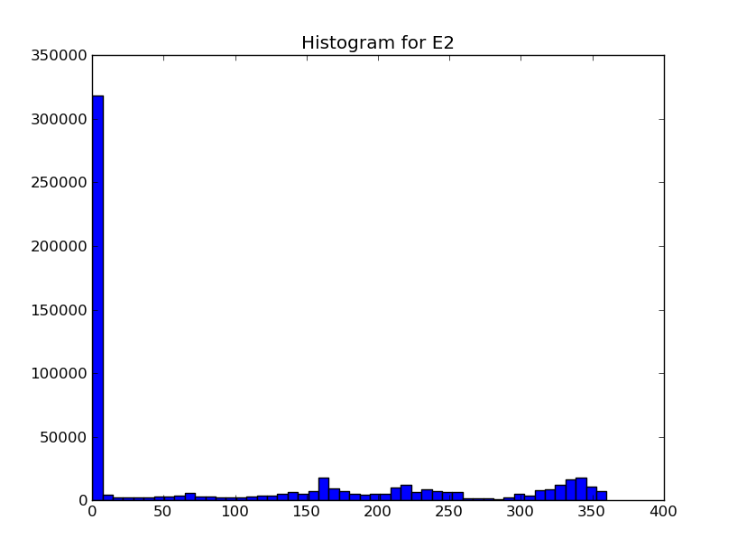
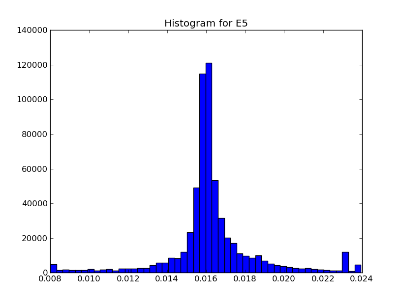

=====================================
Session 1: Initial data visualization
=====================================

Start time
    22-02-2011 22:47

End time
    23-02-2011 03:50

.. toctree::
    :maxdepth: 1

    boxplots

This is the first session. I will start out by trying to get an overview of the data, look at some histograms make some boxplots and scatter plots and maybe try to start removing outliers from the dataset. First i will try to create boxplots of all features. But first I have to import the training data set into python.

.. literalinclude:: /src/data.py

With the script to load data done, I can begin creating histograms for the data

.. literalinclude:: /src/create_histograms.py

The resulting histograms are

.. image:: plots/hist-TrialID.png
    :width: 750px
    
.. image:: plots/hist-ObsNum.png
    :width: 750px
    
.. image:: plots/hist-IsAlert.png
    :width: 750px
    
.. image:: plots/hist-P1.png
    :width: 750px
    
.. image:: plots/hist-P2.png
    :width: 750px
    

    
.. image:: plots/hist-P4.png
    :width: 750px
    
.. image:: plots/hist-P5.png
    :width: 750px
    

    

    
.. image:: plots/hist-P8.png
    :width: 750px
    
.. image:: plots/hist-E1.png
    :width: 750px
    

    
.. image:: plots/hist-E3.png
    :width: 750px
    
.. image:: plots/hist-E4.png
    :width: 750px
    

    
.. image:: plots/hist-E6.png
    :width: 750px
    
.. image:: plots/hist-E7.png
    :width: 750px
    

    
.. image:: plots/hist-E9.png
    :width: 750px
    
.. image:: plots/hist-E10.png
    :width: 750px
    
.. image:: plots/hist-E11.png
    :width: 750px
    

    
.. image:: plots/hist-V2.png
    :width: 750px
    

    
.. image:: plots/hist-V4.png
    :width: 750px
    
.. image:: plots/hist-V5.png
    :width: 750px
    
.. image:: plots/hist-V6.png
    :width: 750px
    
.. image:: plots/hist-V7.png
    :width: 750px
    

    
.. image:: plots/hist-V9.png
    :width: 750px
    
.. image:: plots/hist-V10.png
    :width: 750px
    
.. image:: plots/hist-V11.png
    :width: 750px

A couple of comments on the histograms...

* The feature E6 is zero for all data points and can be neglected
* The feature E5 is zero for almost all data points and could probably be neglected too

Ok a lesson learned. Of course I can't claim that E5 is zero for almost all data points, based on the histogram above. What i can say, is that most values of E5 is in the first bin, in the above histogram. If i change the range of the histogram I get another picture

.. image:: plots/hist-P5-manual.png
    :width: 750px

The code to create the above histogram is::

    plt.hist(A[:,7], range=(0, 0.8), bins=50)
    plt.savefig(...)
