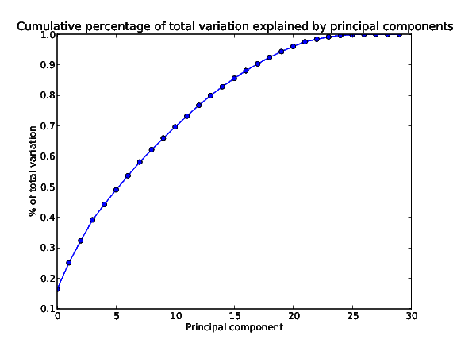
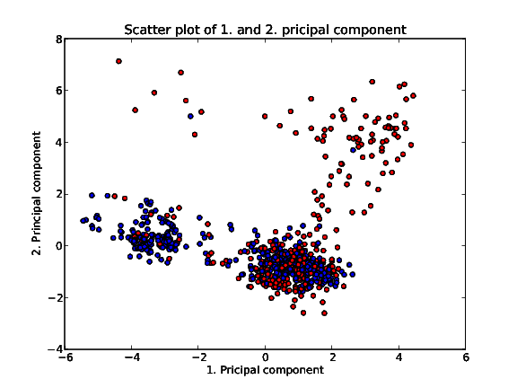
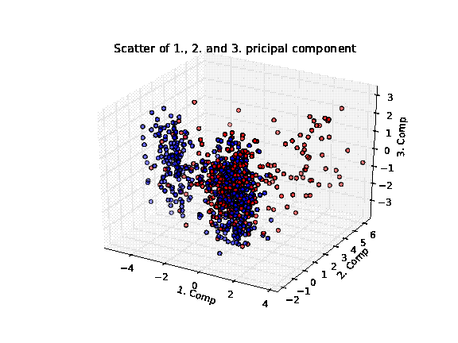

=============================================
Session 15: New principal components analysis
=============================================

Start time:
    15-05-2011 21:25

End time:
    15-05-2011 23:25

In this session I will create a new PCA, with the data normalized. When the data isn't standardized, but only mean centered, the features with the numerically largest standard deviation, dominates the pricipal components. One of the results is that a few pricipal components can explain most of the variation. In :doc:`../12-principal-components-analysis/index`, I found that the first 4 pricipal components explained more than 99% of the total variation. Not very likely in a 30-dimensional dataset.

Normalizing the data
====================

First the data needs to be normalized. To ensure a decent speed in the following calculations, a script calculates the normalized data set and saves it to disk. That way the data can be loaded pretty fast. The script that creates the data set is shown here

.. literalinclude:: /src/normalize_data_2.py

Calculating and plotting PCA
============================

Now the PCA is calculated. The script is a copy of the script from :doc:`../12-principal-components-analysis/index`, and is

.. literalinclude:: scripts/calc_pca_and_plot.py

From the calculated PCA, a plot of the explained variance is created

This looks a lot more plausible. Now the first 6 principal components are required to explained 50% of the total variation. And about 17 principal components are required to explain 90% of the total variation.

A single scatter plot of the first two principal components is created

At least three clusters can be seen on the plot. One cluster in the upper right with almost exclusively red datarows. A cluster in the lower left with many blue points and some red points. And a cluster in the lower right with a great mix of red and blue points. To get another view on the data, a 3d plot of the first three principal components is created

