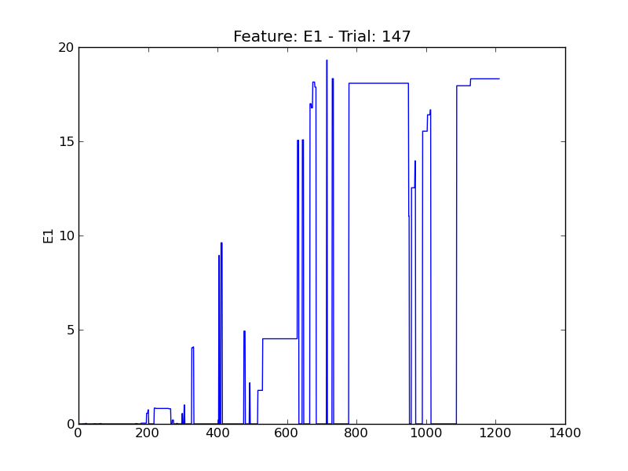
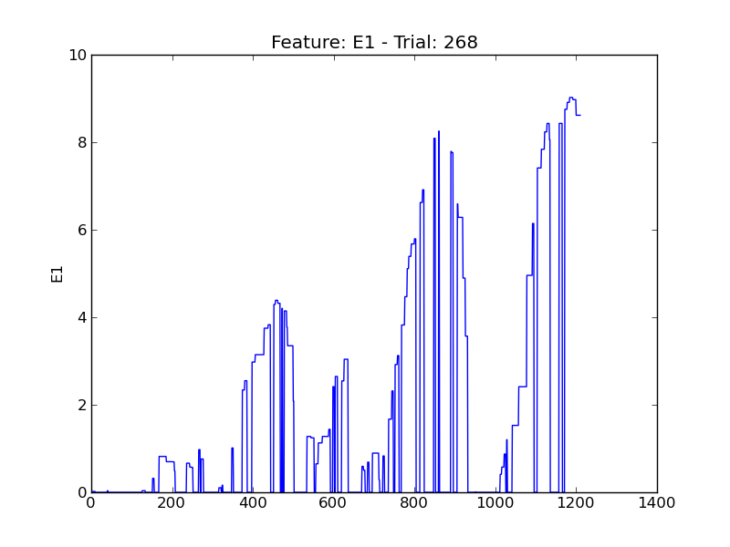
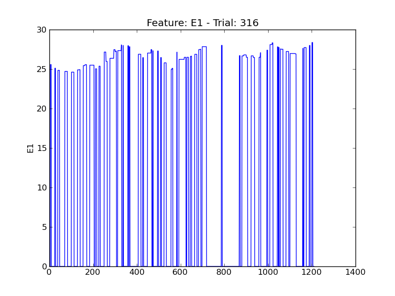
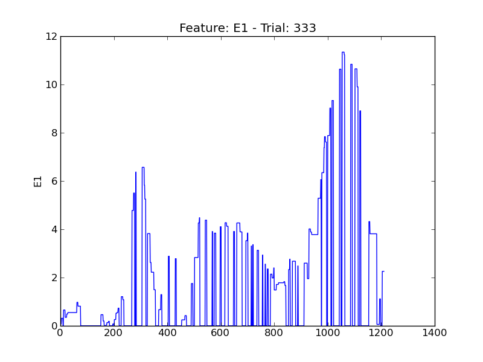

==
E1
==

.. image:: plots/t12-E1.png
    :width: 550px

.. image:: plots/t201-E1.png
    :width: 550px

.. image:: plots/t203-E1.png
    :width: 550px

.. image:: plots/t288-E1.png
    :width: 550px

.. image:: plots/t313-E1.png
    :width: 550px

.. image:: plots/t411-E1.png
    :width: 550px

.. image:: plots/t435-E1.png
    :width: 550px

.. image:: plots/t442-E1.png
    :width: 550px

.. image:: plots/t47-E1.png
    :width: 550px

.. image:: plots/t490-E1.png
    :width: 550px

.. image:: plots/t89-E1.png
    :width: 550px
