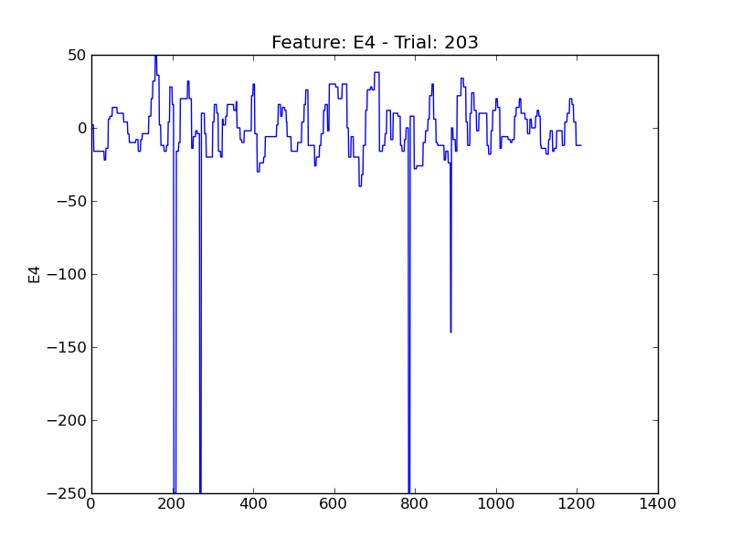
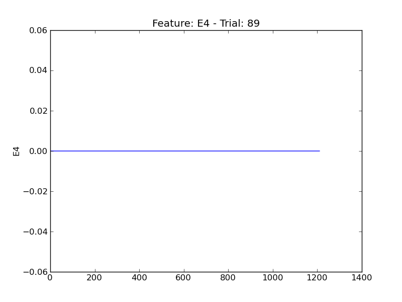

==
E4
==

.. image:: plots/t12-E4.png
    :width: 550px

.. image:: plots/t147-E4.png
    :width: 550px

.. image:: plots/t201-E4.png
    :width: 550px

.. image:: plots/t313-E4.png
    :width: 550px

.. image:: plots/t316-E4.png
    :width: 550px

.. image:: plots/t411-E4.png
    :width: 550px

.. image:: plots/t442-E4.png
    :width: 550px

.. image:: plots/t47-E4.png
    :width: 550px

.. image:: plots/t490-E4.png
    :width: 550px

.. image:: plots/t494-E4.png
    :width: 550px

