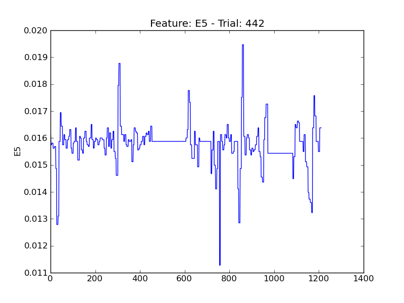

==
E5
==

.. image:: plots/t12-E5.png
    :width: 550px

.. image:: plots/t147-E5.png
    :width: 550px

.. image:: plots/t203-E5.png
    :width: 550px

.. image:: plots/t268-E5.png
    :width: 550px

.. image:: plots/t313-E5.png
    :width: 550px

.. image:: plots/t333-E5.png
    :width: 550px

.. image:: plots/t411-E5.png
    :width: 550px

.. image:: plots/t47-E5.png
    :width: 550px

.. image:: plots/t490-E5.png
    :width: 550px

.. image:: plots/t89-E5.png
    :width: 550px
