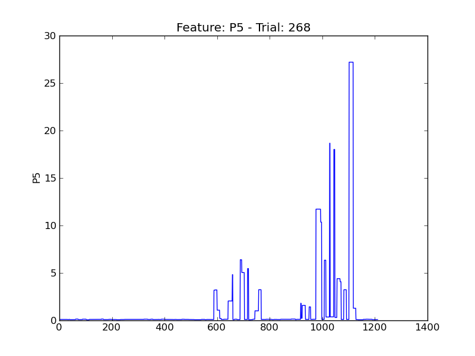

==
P5
==

.. image:: plots/t201-P5.png
    :width: 550px

.. image:: plots/t203-P5.png
    :width: 550px

.. image:: plots/t313-P5.png
    :width: 550px

.. image:: plots/t333-P5.png
    :width: 550px

.. image:: plots/t442-P5.png
    :width: 550px

.. image:: plots/t47-P5.png
    :width: 550px

.. image:: plots/t494-P5.png
    :width: 550px

.. image:: plots/t89-P5.png
    :width: 550px
