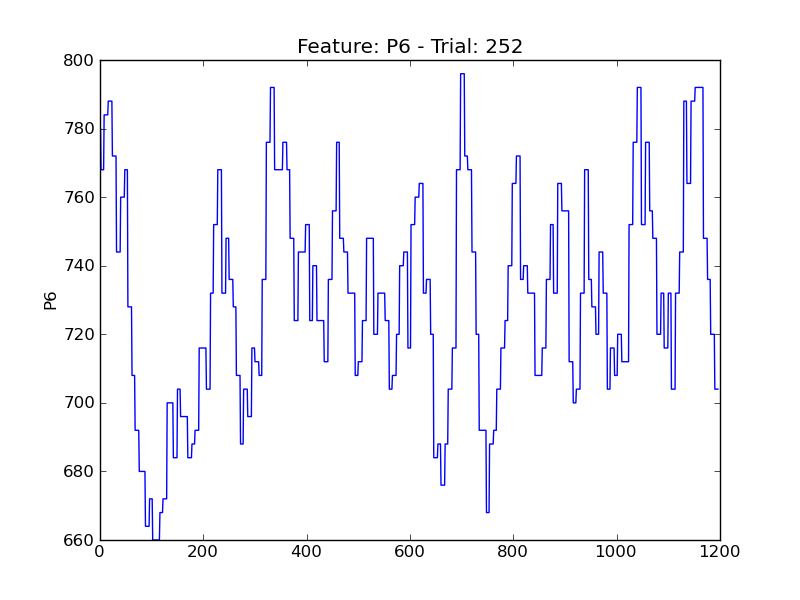
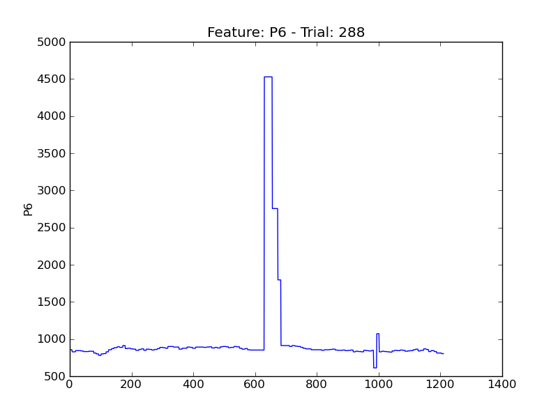
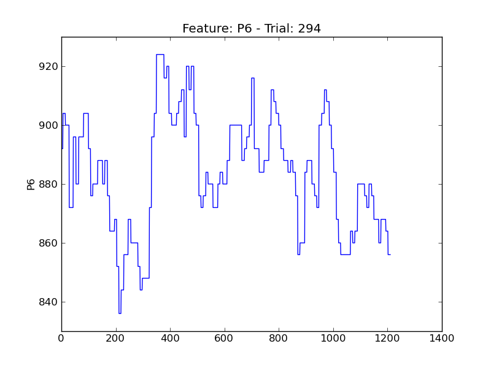
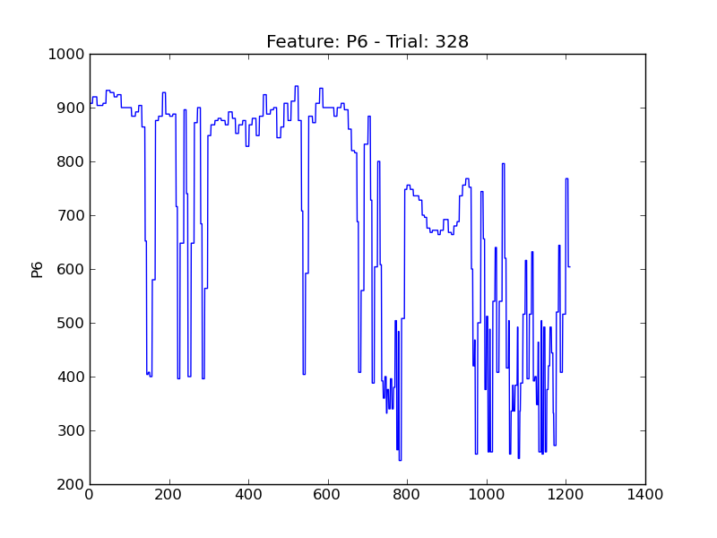
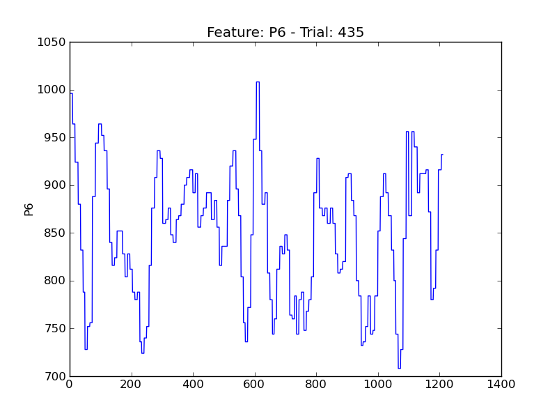
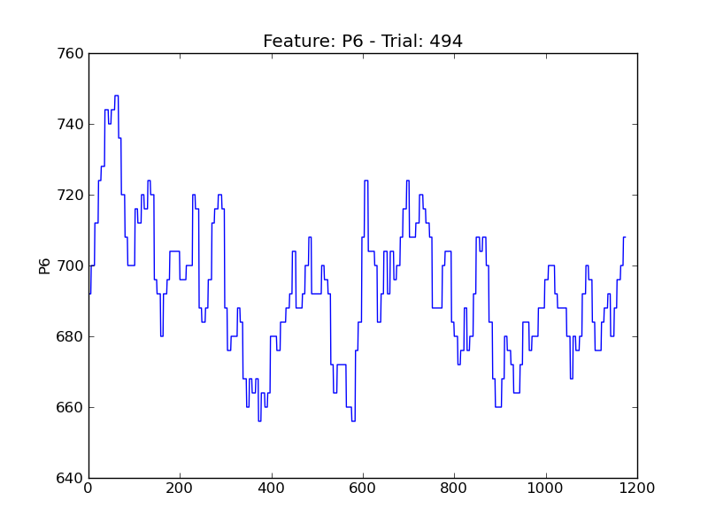
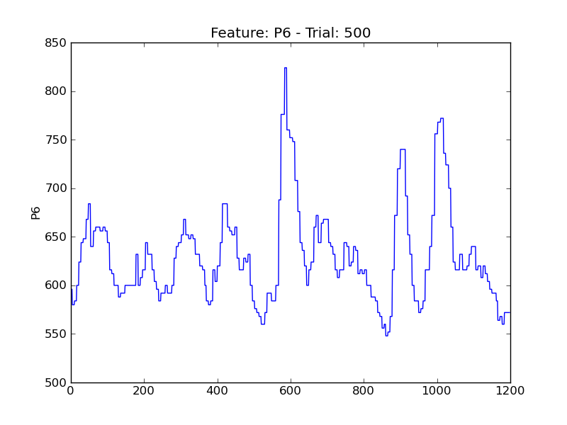
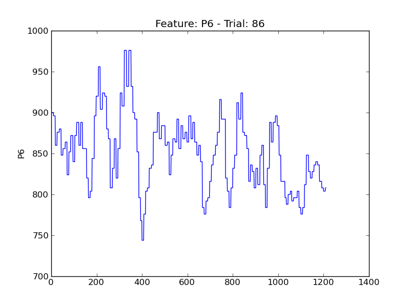

==
P6
==

.. image:: plots/t12-P6.png
    :width: 550px

.. image:: plots/t147-P6.png
    :width: 550px

.. image:: plots/t201-P6.png
    :width: 550px

.. image:: plots/t203-P6.png
    :width: 550px

.. image:: plots/t268-P6.png
    :width: 550px

.. image:: plots/t313-P6.png
    :width: 550px

.. image:: plots/t316-P6.png
    :width: 550px

.. image:: plots/t333-P6.png
    :width: 550px

.. image:: plots/t411-P6.png
    :width: 550px

.. image:: plots/t442-P6.png
    :width: 550px

.. image:: plots/t47-P6.png
    :width: 550px

.. image:: plots/t490-P6.png
    :width: 550px

.. image:: plots/t89-P6.png
    :width: 550px
