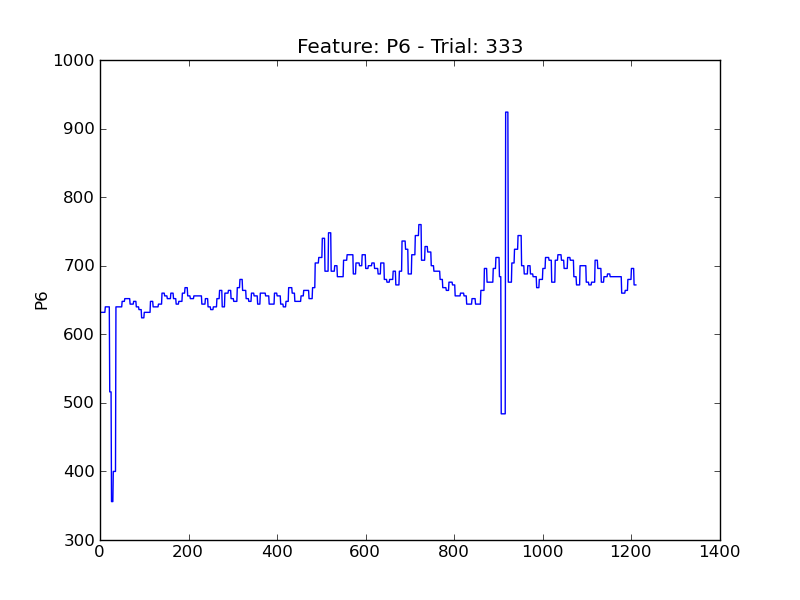
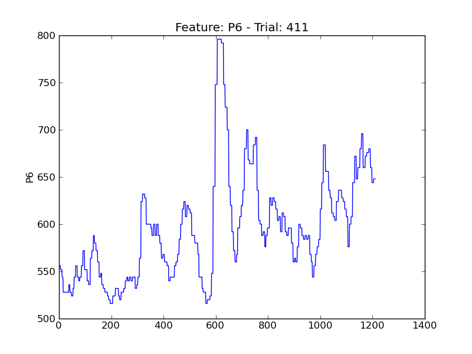
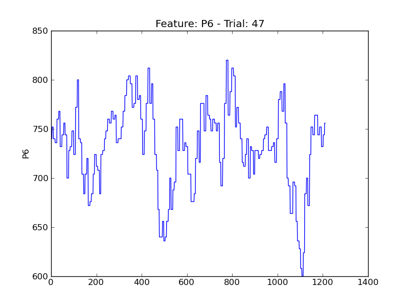
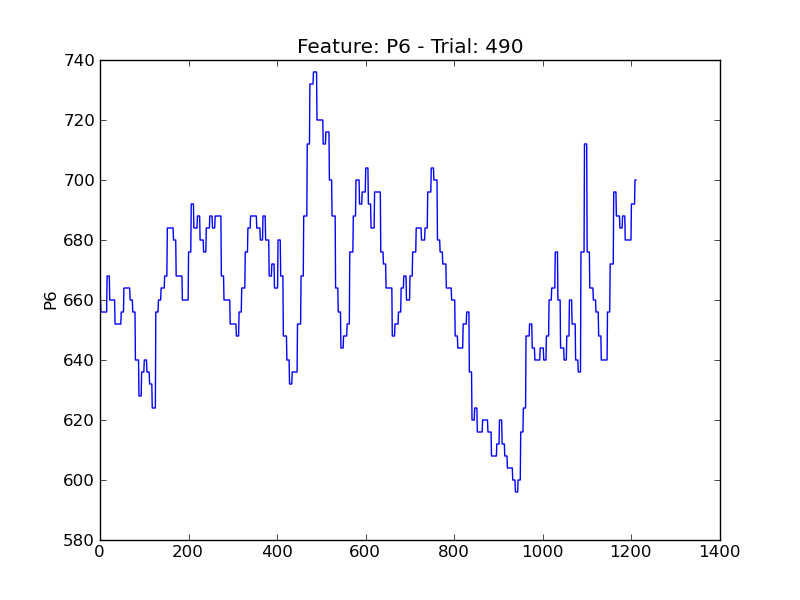

==
P6
==

.. image:: plots/t12-P6.png
    :width: 550px

.. image:: plots/t147-P6.png
    :width: 550px

.. image:: plots/t201-P6.png
    :width: 550px

.. image:: plots/t203-P6.png
    :width: 550px

.. image:: plots/t268-P6.png
    :width: 550px

.. image:: plots/t288-P6.png
    :width: 550px

.. image:: plots/t313-P6.png
    :width: 550px

.. image:: plots/t316-P6.png
    :width: 550px

.. image:: plots/t328-P6.png
    :width: 550px

.. image:: plots/t435-P6.png
    :width: 550px

.. image:: plots/t442-P6.png
    :width: 550px

.. image:: plots/t494-P6.png
    :width: 550px

.. image:: plots/t500-P6.png
    :width: 550px

.. image:: plots/t89-P6.png
    :width: 550px
