==
V3
==

.. image:: plots/t12-V3.png
    :width: 550px

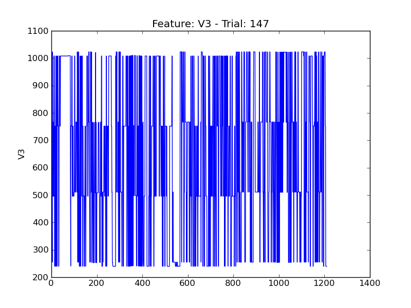

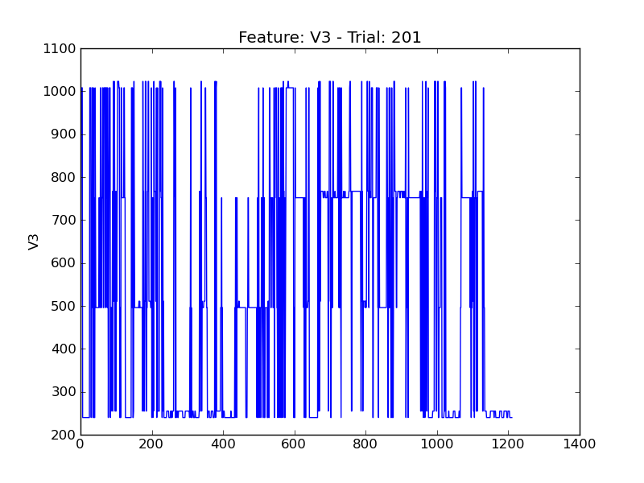

.. image:: plots/t203-V3.png
    :width: 550px

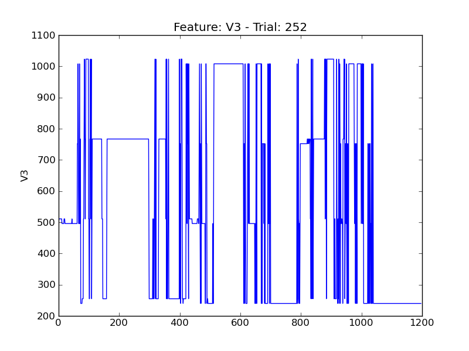

.. image:: plots/t268-V3.png
    :width: 550px

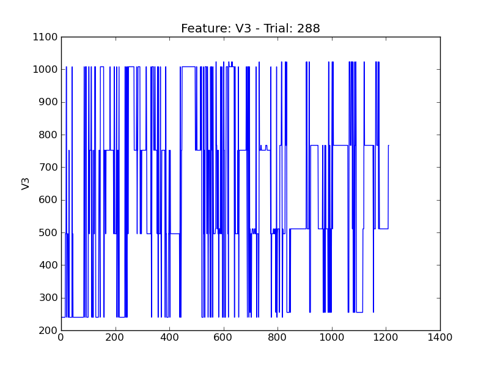

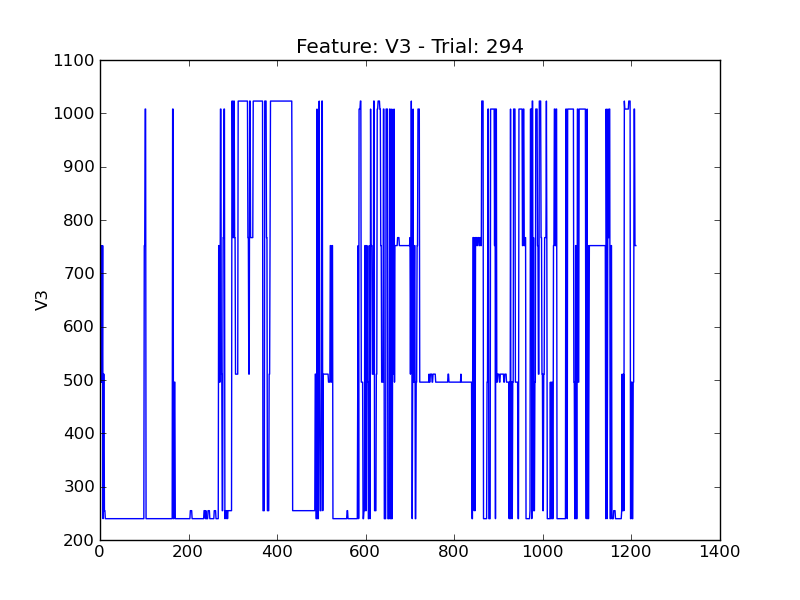

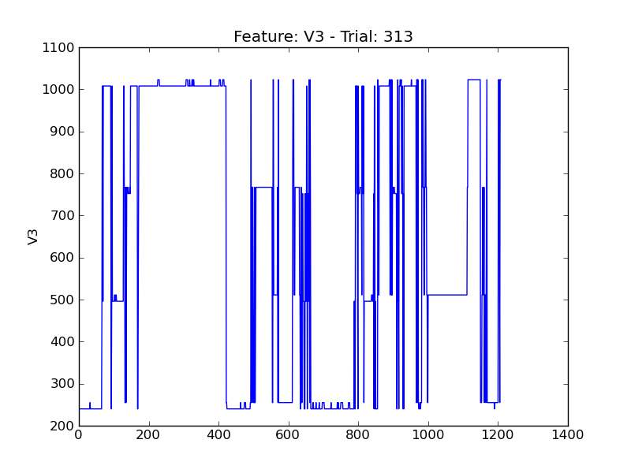

.. image:: plots/t316-V3.png
    :width: 550px

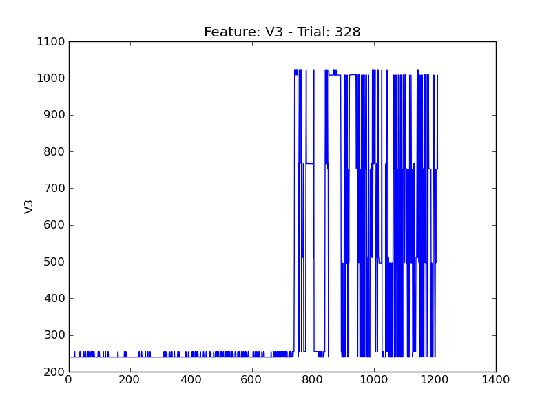

.. image:: plots/t333-V3.png
    :width: 550px

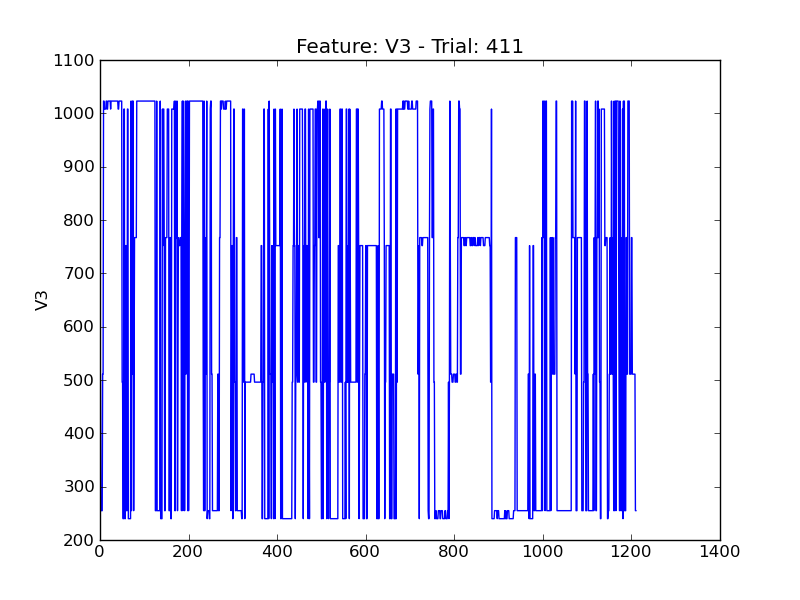

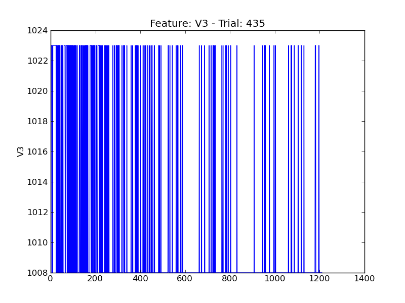

.. image:: plots/t442-V3.png
    :width: 550px

.. image:: plots/t47-V3.png
    :width: 550px

.. image:: plots/t490-V3.png
    :width: 550px

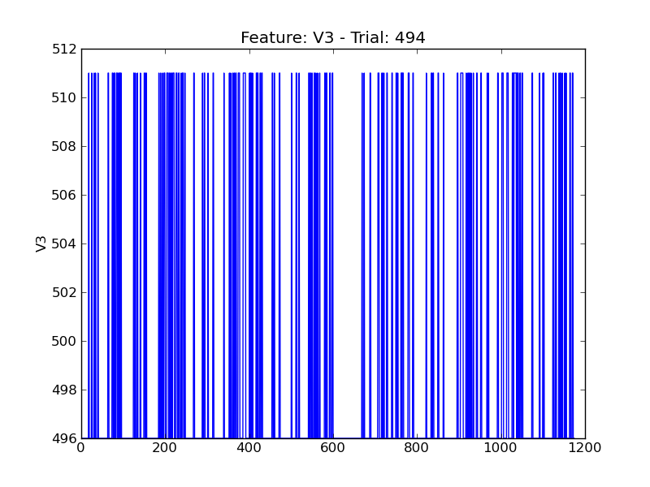

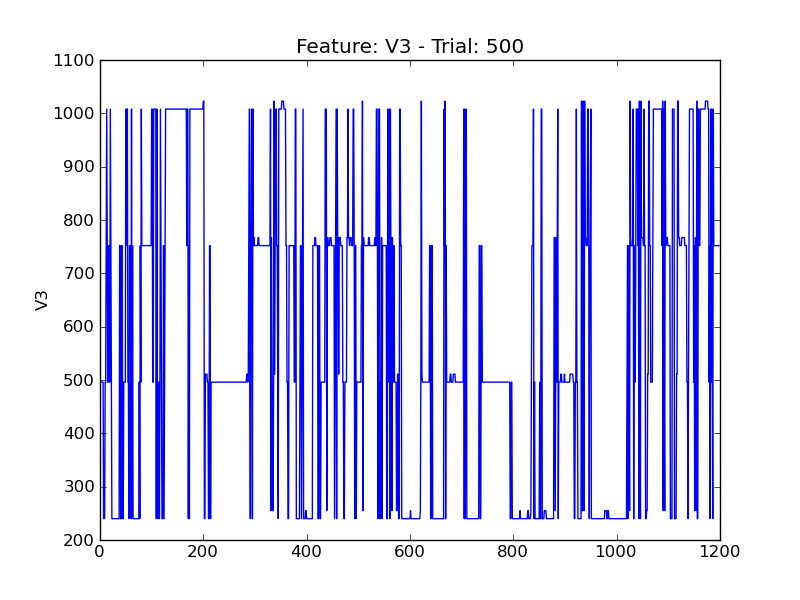

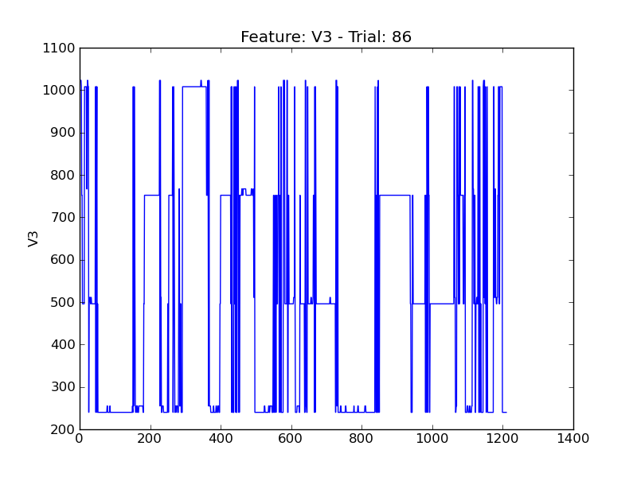

.. image:: plots/t89-V3.png
    :width: 550px
