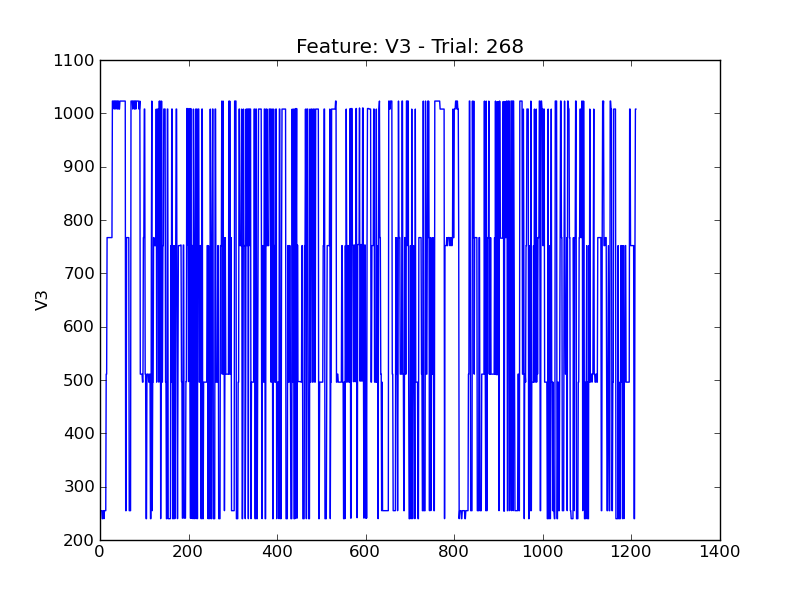
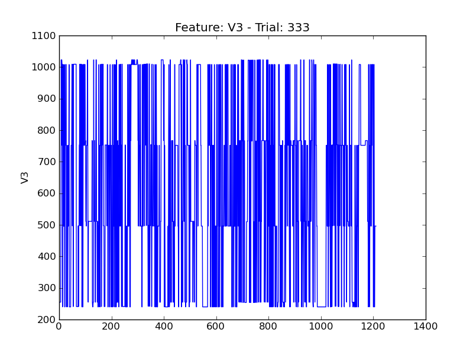
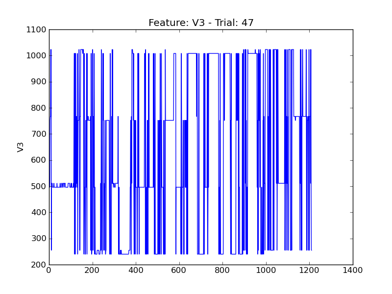
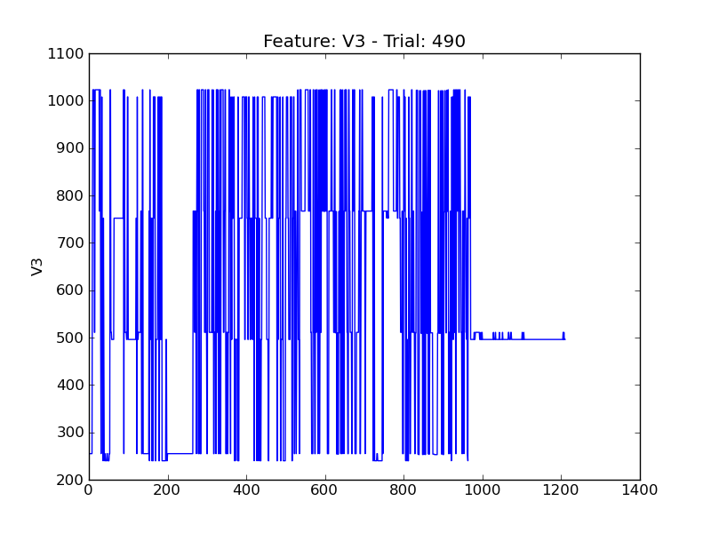

==
V3
==

.. image:: plots/t12-V3.png
    :width: 550px

.. image:: plots/t147-V3.png
    :width: 550px

.. image:: plots/t201-V3.png
    :width: 550px

.. image:: plots/t203-V3.png
    :width: 550px

.. image:: plots/t313-V3.png
    :width: 550px

.. image:: plots/t316-V3.png
    :width: 550px

.. image:: plots/t442-V3.png
    :width: 550px

.. image:: plots/t89-V3.png
    :width: 550px
