===
t12
===

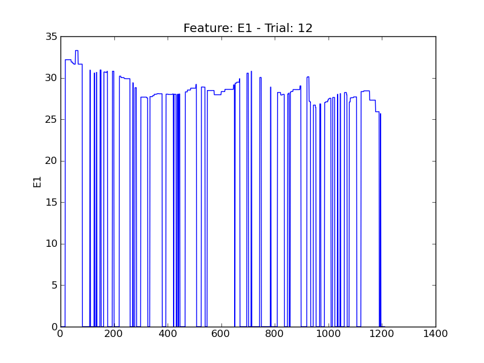

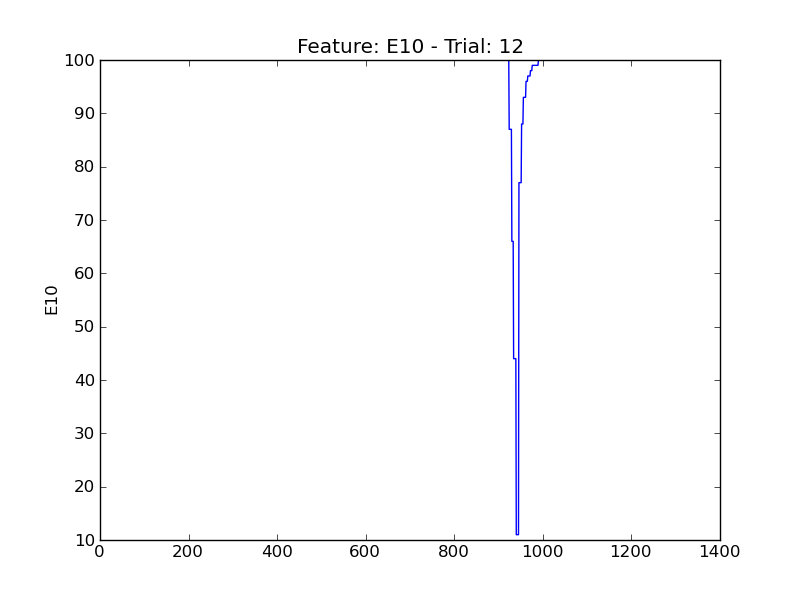

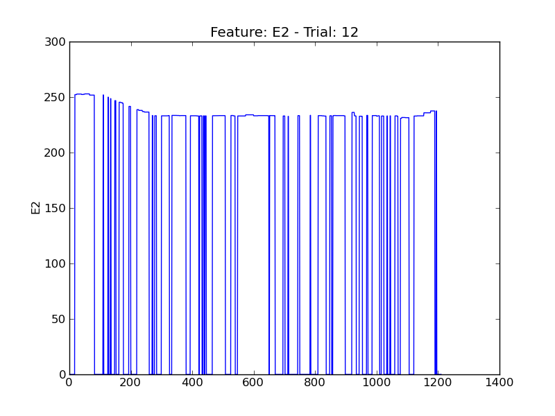

.. image:: plots/t12-E4.png
    :width: 550px

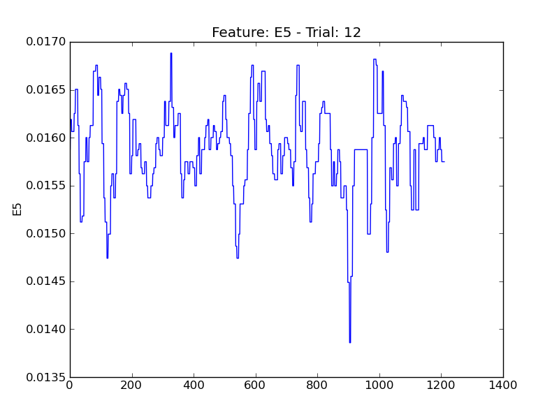

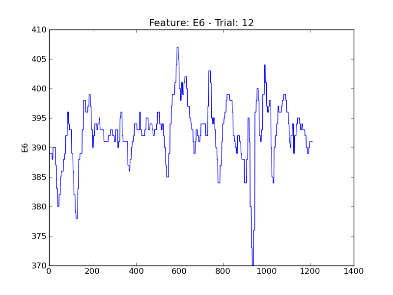

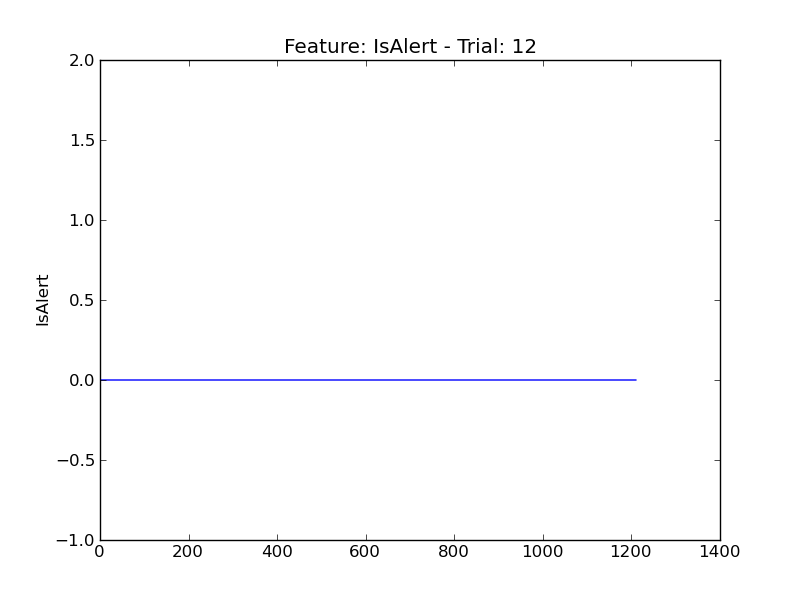

.. image:: plots/t12-P1.png
    :width: 550px

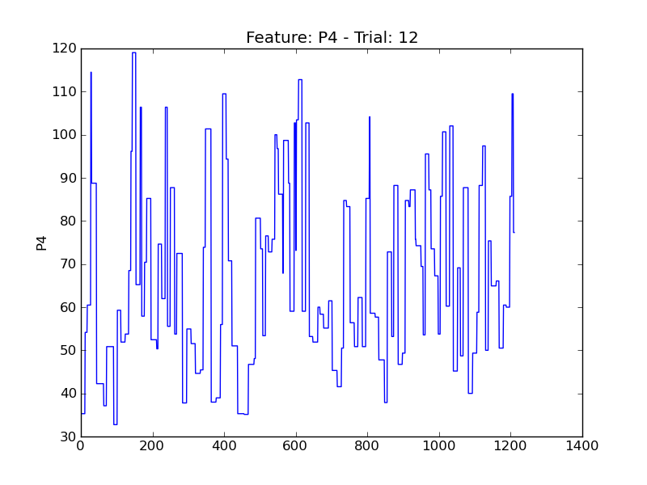

.. image:: plots/t12-P5.png
    :width: 550px

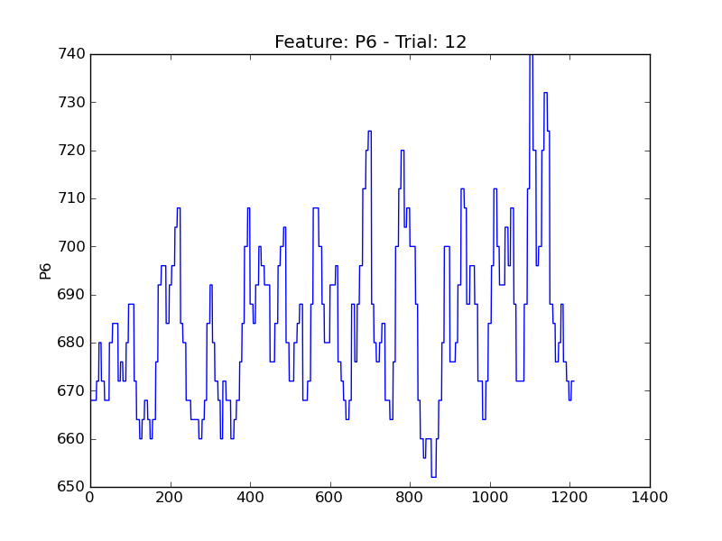

.. image:: plots/t12-P7.png
    :width: 550px

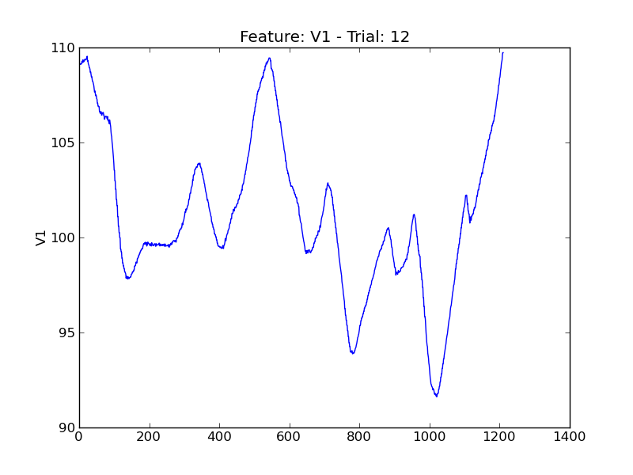

.. image:: plots/t12-V11.png
    :width: 550px

.. image:: plots/t12-V2.png
    :width: 550px

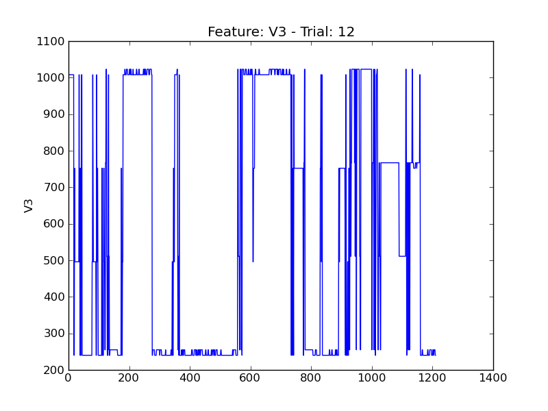

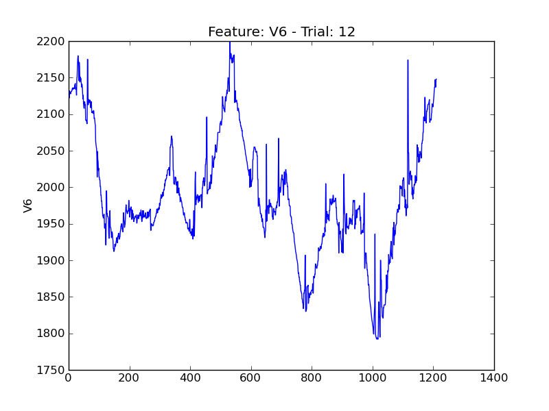

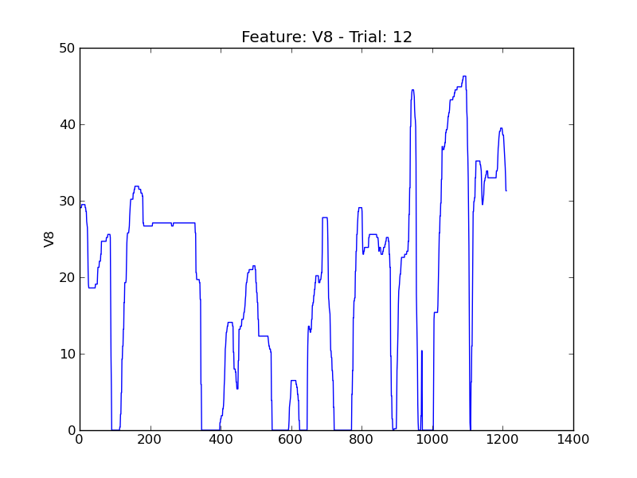
