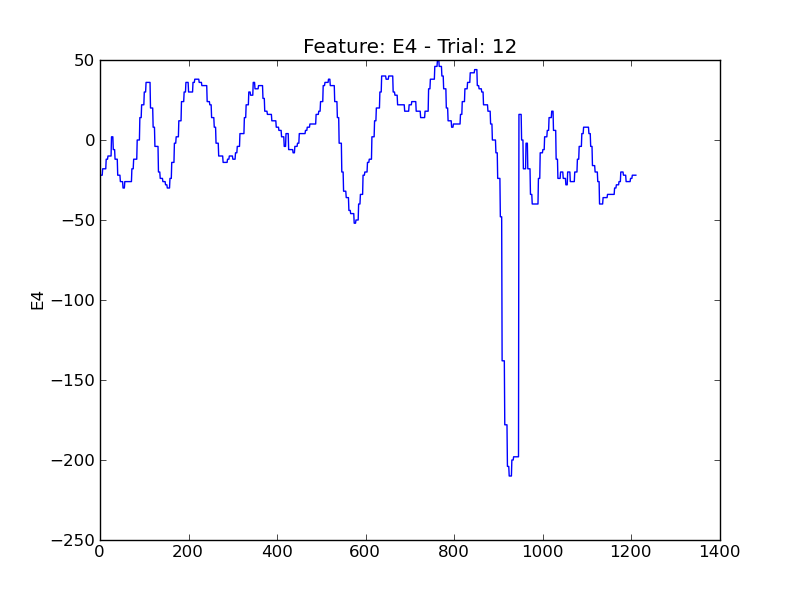
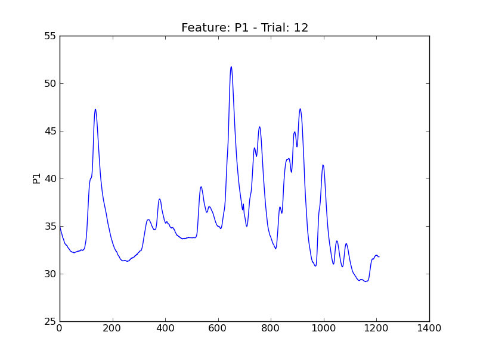
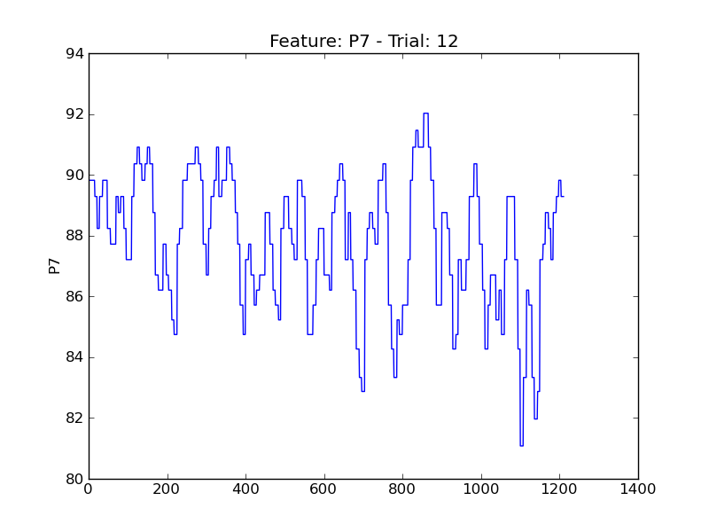
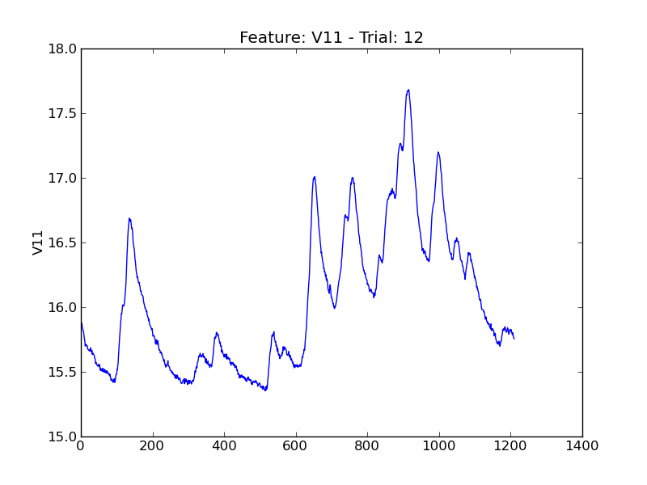

===
t12
===

.. image:: plots/t12-E2.png
    :width: 550px

.. image:: plots/t12-P5.png
    :width: 550px

.. image:: plots/t12-V1.png
    :width: 550px

.. image:: plots/t12-V2.png
    :width: 550px

