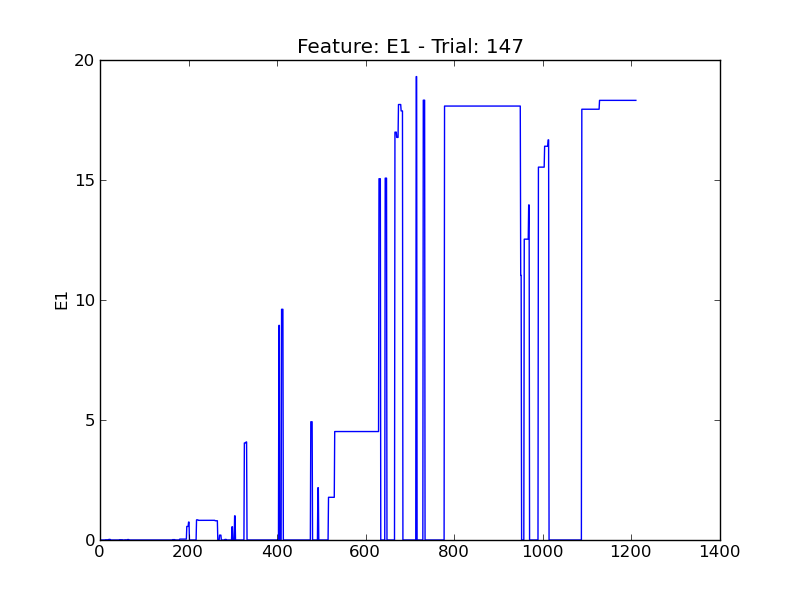
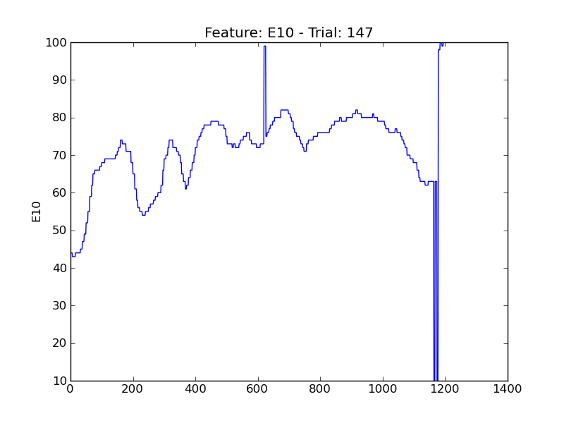
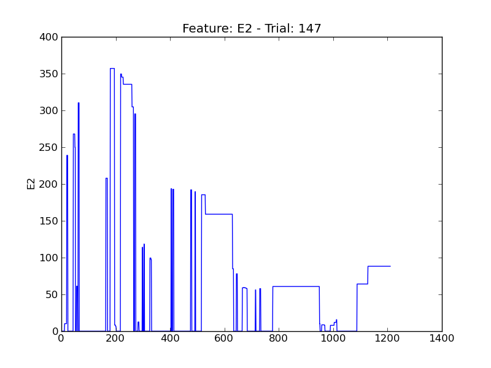
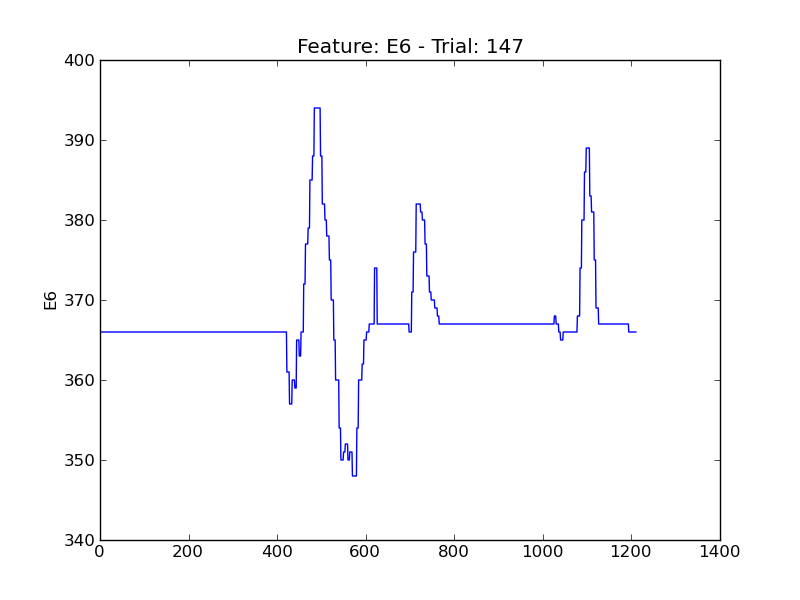
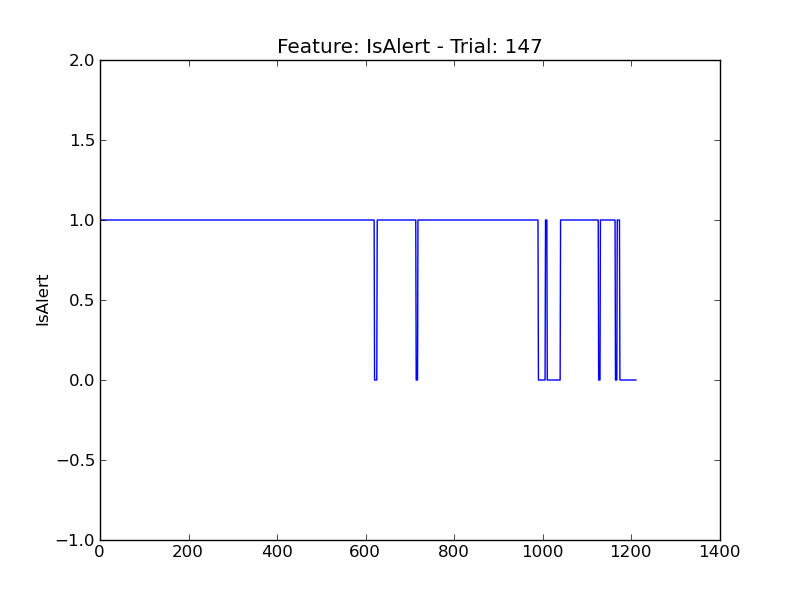
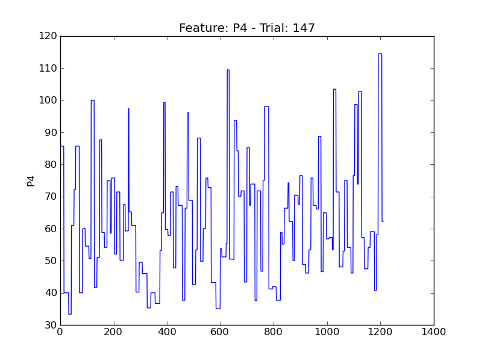
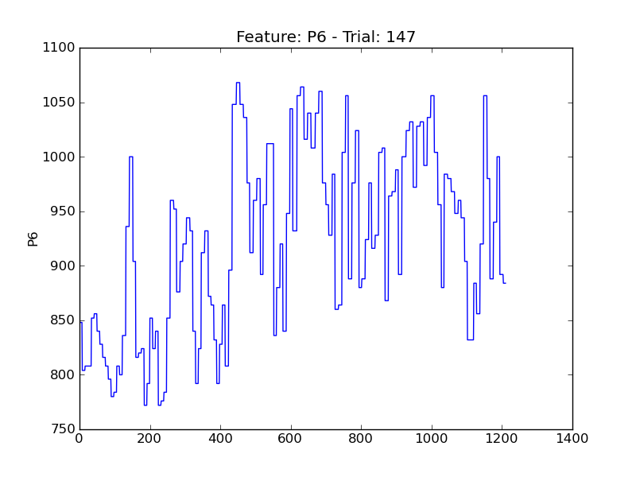
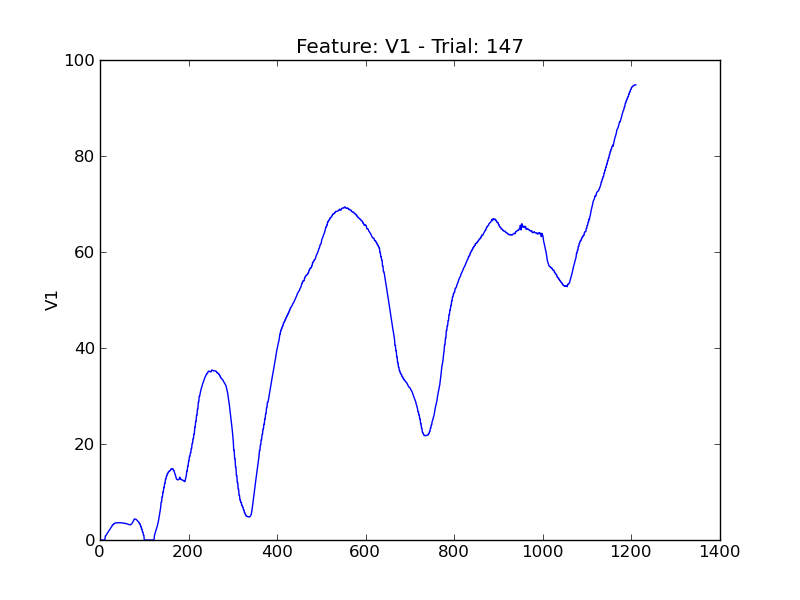
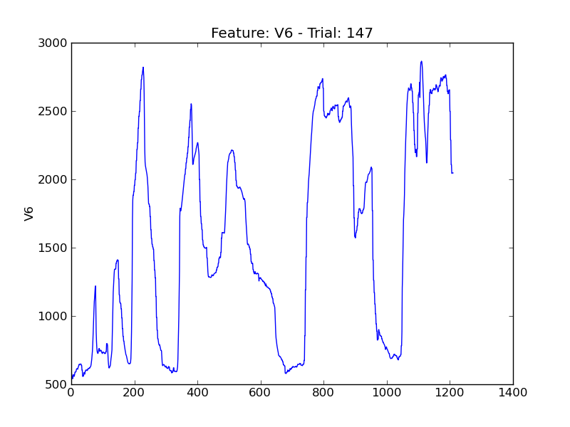
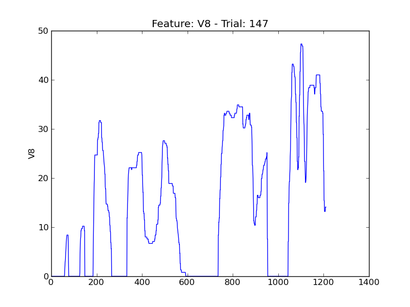

====
t147
====

.. image:: plots/t147-E4.png
    :width: 550px

.. image:: plots/t147-E5.png
    :width: 550px

.. image:: plots/t147-P1.png
    :width: 550px

.. image:: plots/t147-P5.png
    :width: 550px

.. image:: plots/t147-P7.png
    :width: 550px

.. image:: plots/t147-V11.png
    :width: 550px

.. image:: plots/t147-V2.png
    :width: 550px

.. image:: plots/t147-V3.png
    :width: 550px

