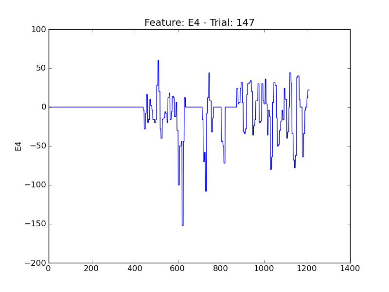
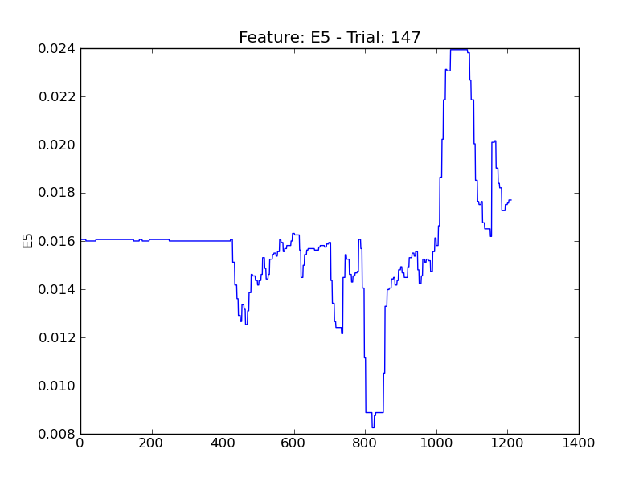
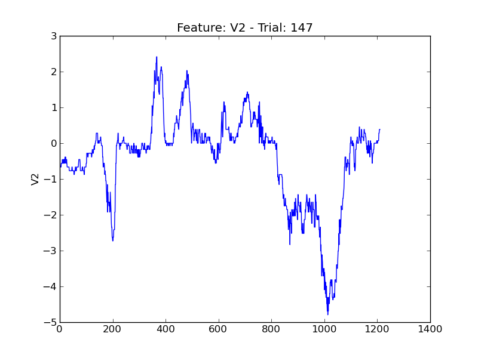
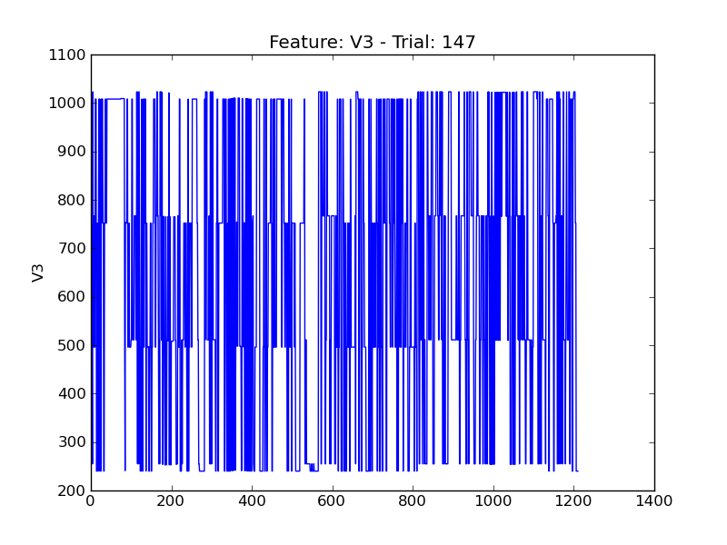

====
t147
====

.. image:: plots/t147-E1.png
    :width: 550px

.. image:: plots/t147-E2.png
    :width: 550px

.. image:: plots/t147-P1.png
    :width: 550px

.. image:: plots/t147-P5.png
    :width: 550px

.. image:: plots/t147-P6.png
    :width: 550px

.. image:: plots/t147-P7.png
    :width: 550px

.. image:: plots/t147-V11.png
    :width: 550px

.. image:: plots/t147-V8.png
    :width: 550px
