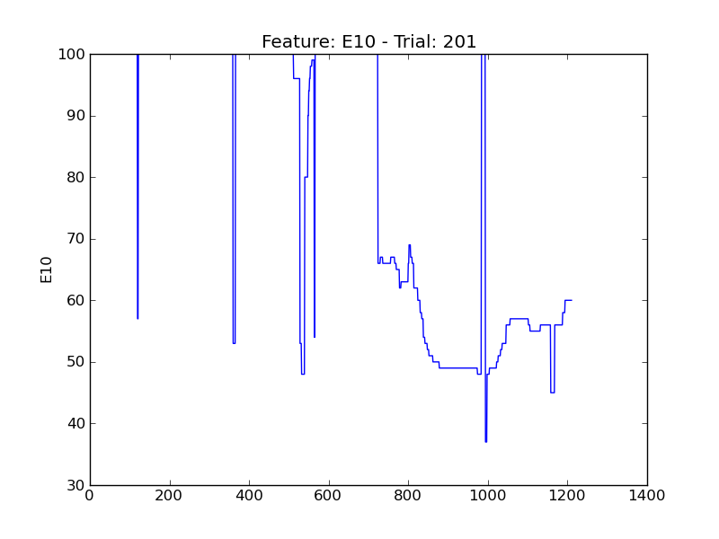
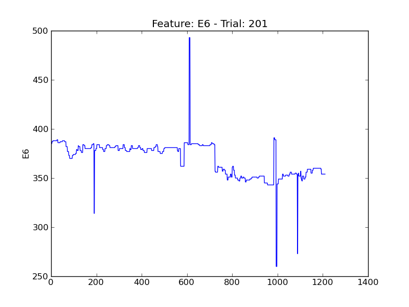
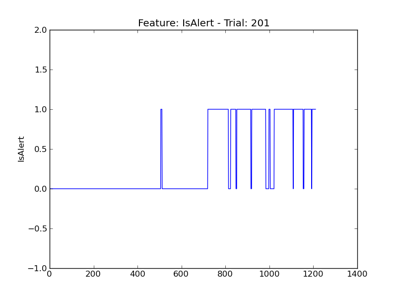
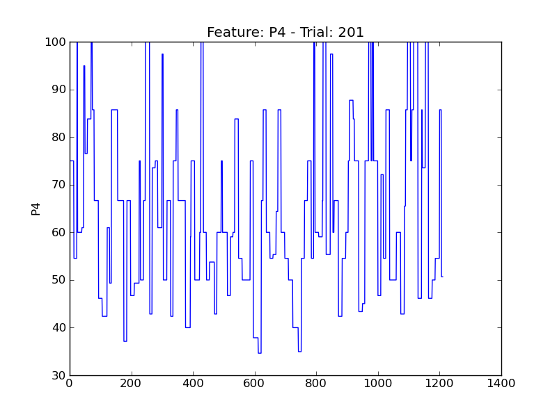
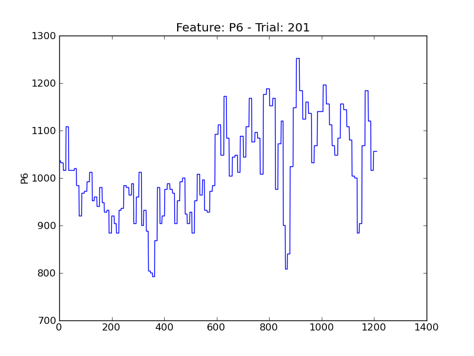
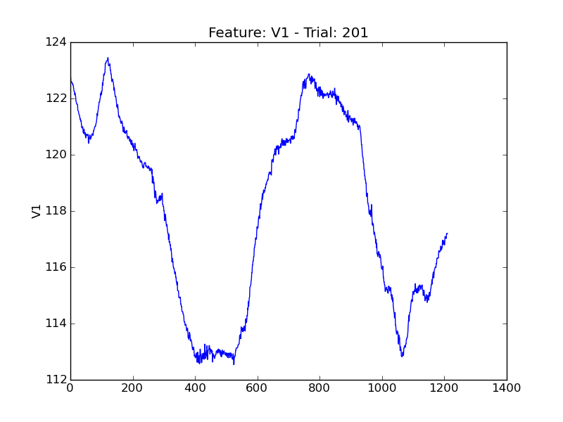
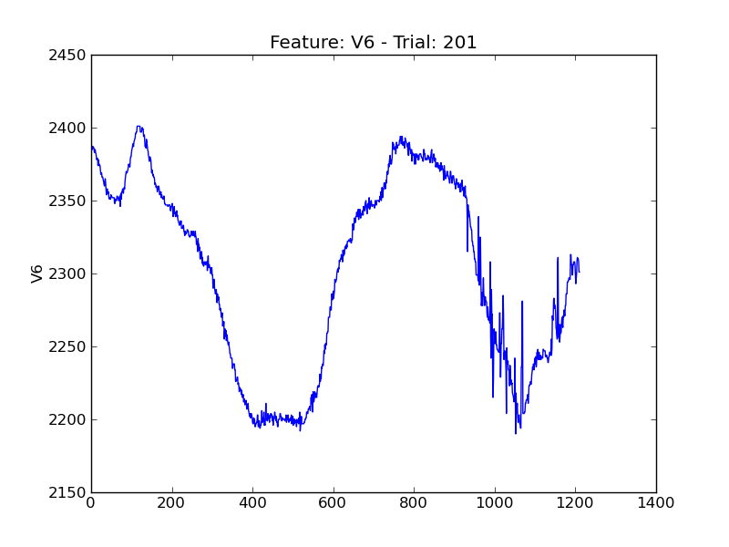
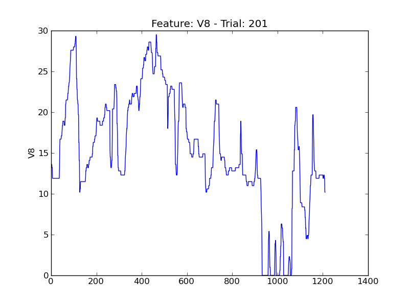

====
t201
====

.. image:: plots/t201-E1.png
    :width: 550px

.. image:: plots/t201-E2.png
    :width: 550px

.. image:: plots/t201-E4.png
    :width: 550px

.. image:: plots/t201-E5.png
    :width: 550px

.. image:: plots/t201-P1.png
    :width: 550px

.. image:: plots/t201-P5.png
    :width: 550px

.. image:: plots/t201-P7.png
    :width: 550px

.. image:: plots/t201-V11.png
    :width: 550px

.. image:: plots/t201-V2.png
    :width: 550px

.. image:: plots/t201-V3.png
    :width: 550px

