====
t268
====

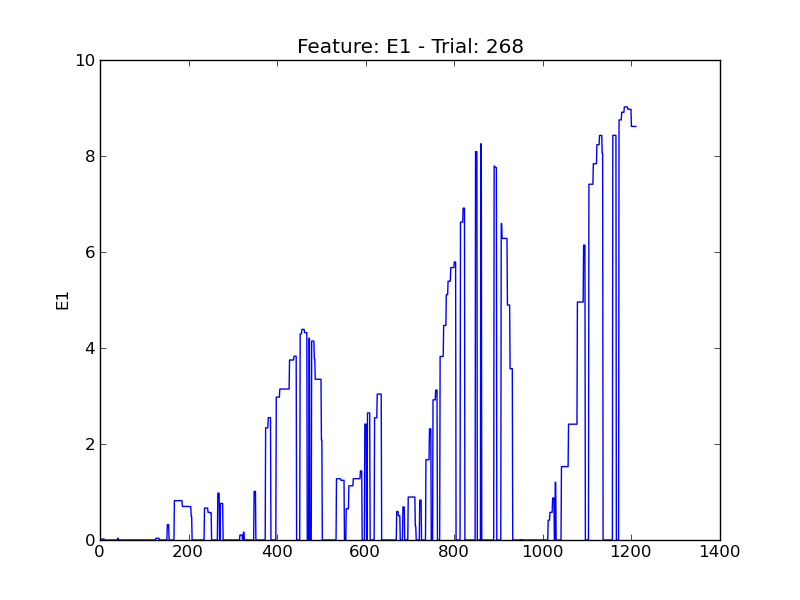

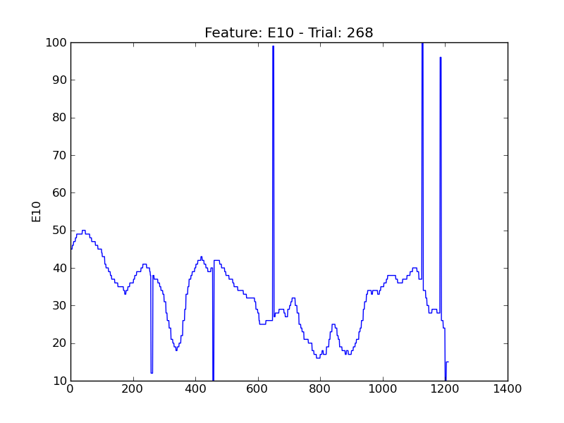

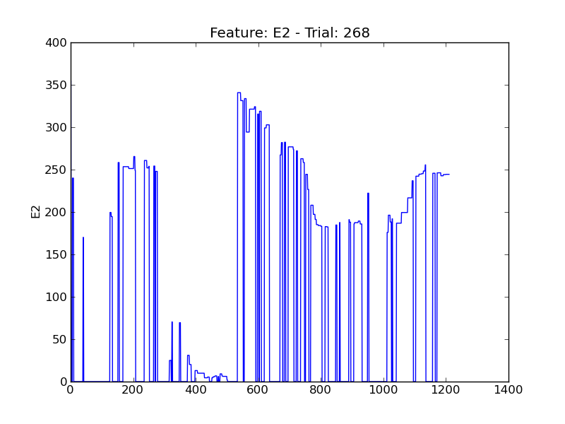

.. image:: plots/t268-E4.png
    :width: 550px

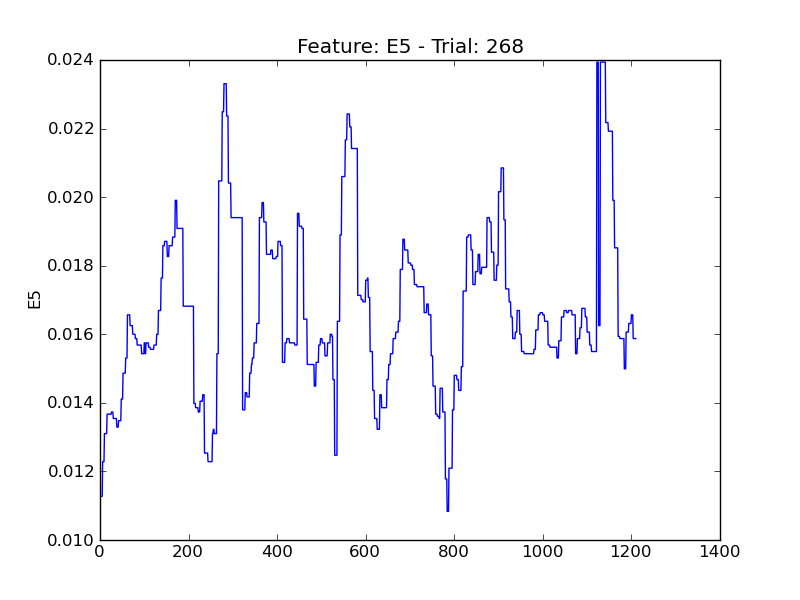

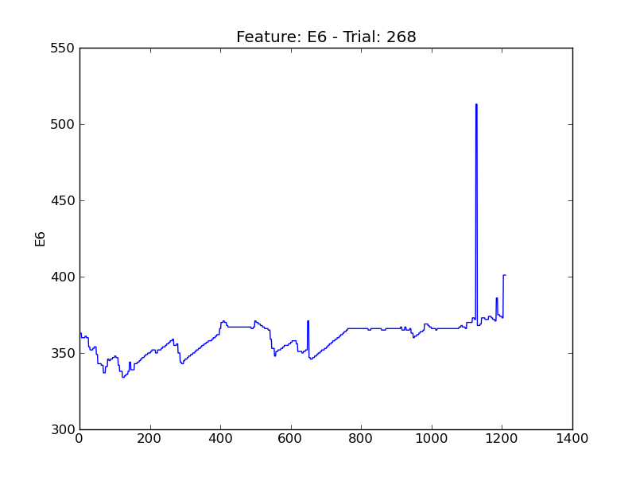

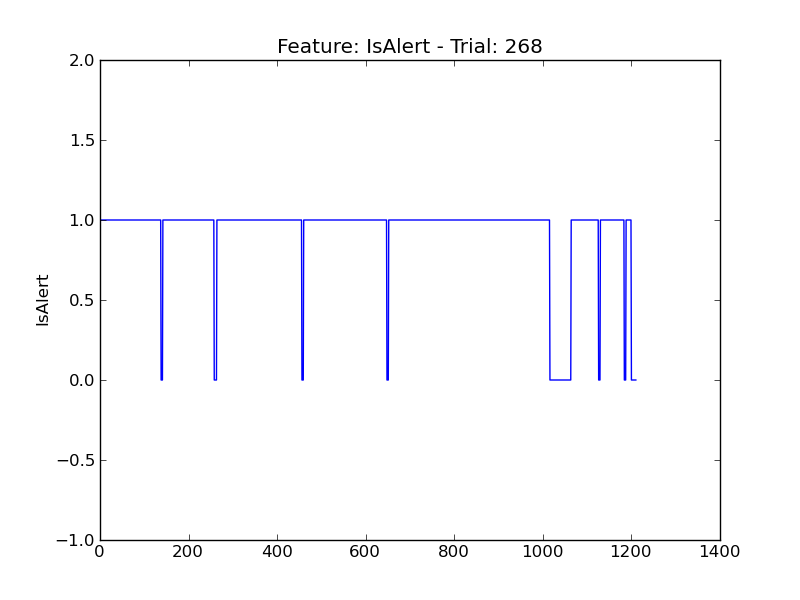

.. image:: plots/t268-P1.png
    :width: 550px

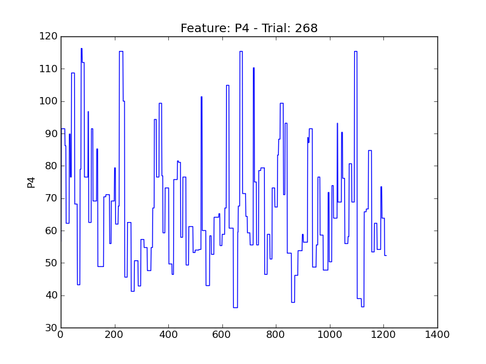

.. image:: plots/t268-P5.png
    :width: 550px

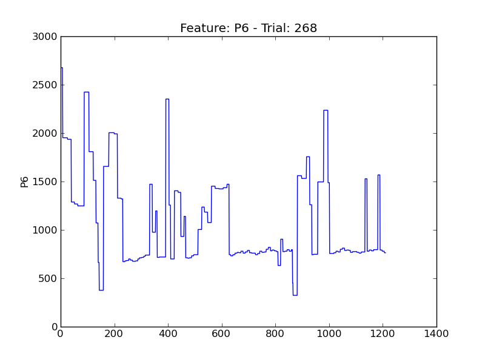

.. image:: plots/t268-P7.png
    :width: 550px

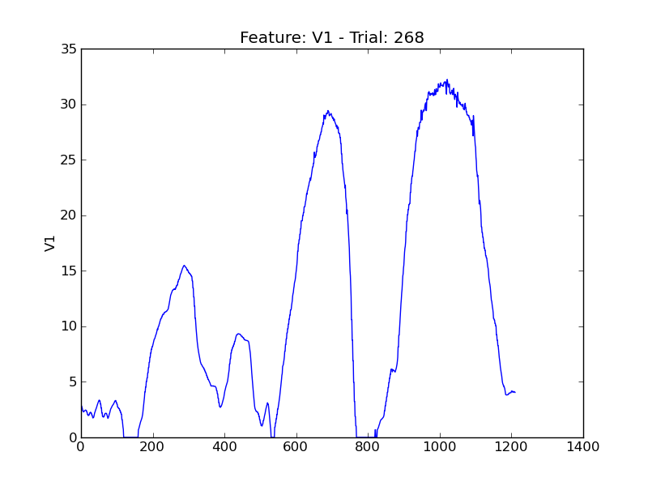

.. image:: plots/t268-V11.png
    :width: 550px

.. image:: plots/t268-V2.png
    :width: 550px

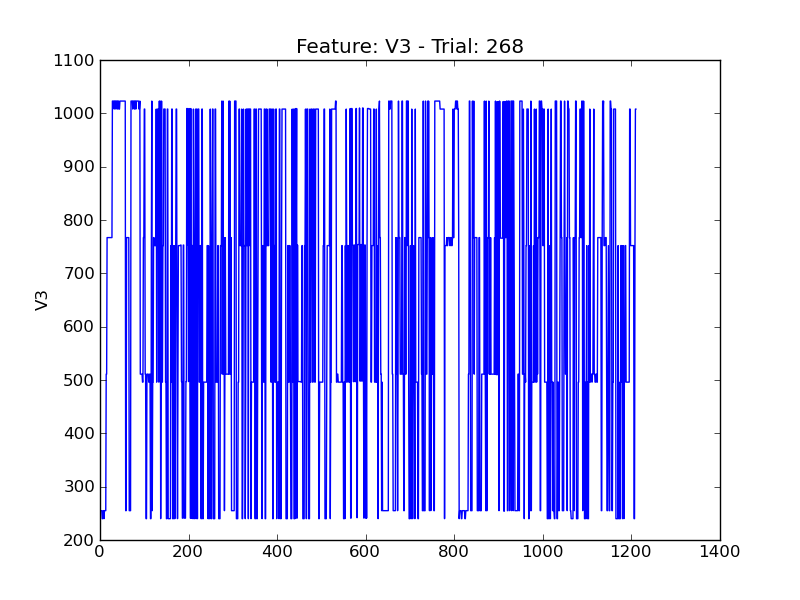

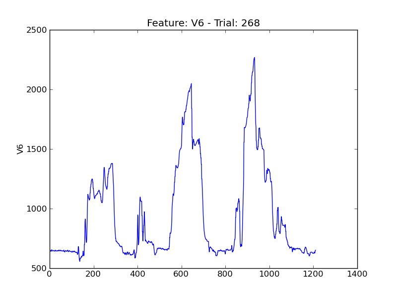

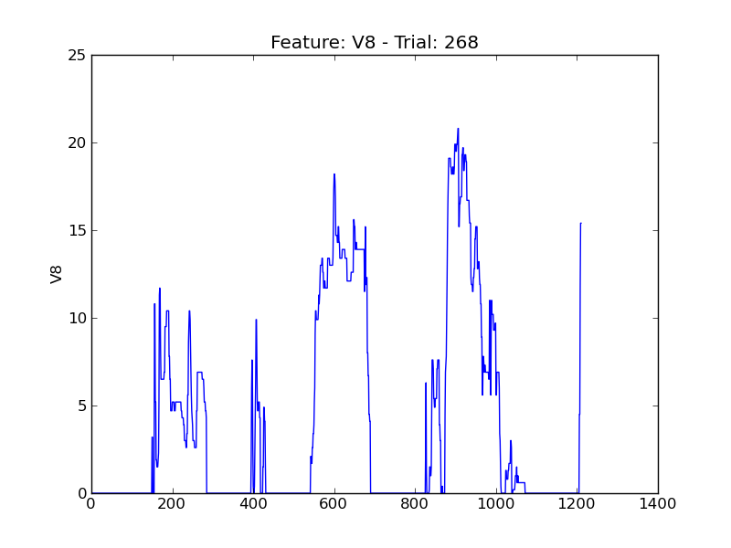
