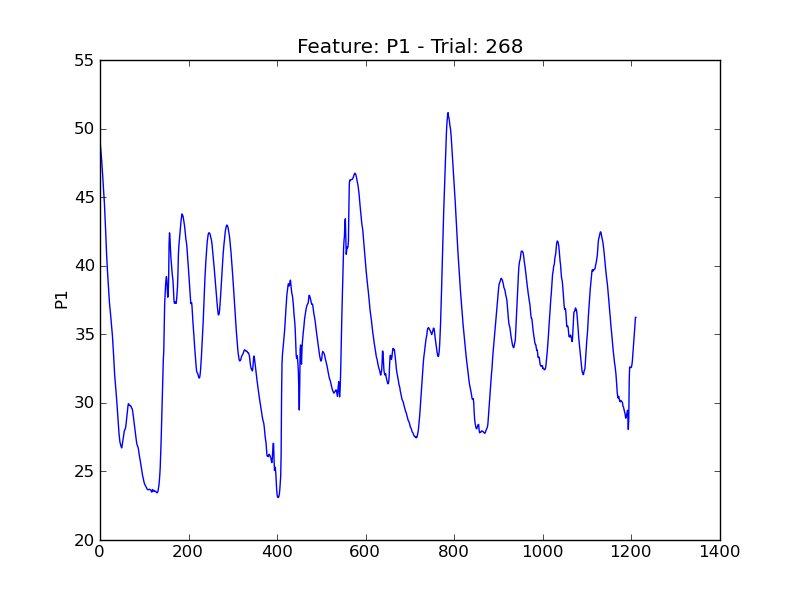

====
t268
====

.. image:: plots/t268-E1.png
    :width: 550px

.. image:: plots/t268-E4.png
    :width: 550px

.. image:: plots/t268-P5.png
    :width: 550px

.. image:: plots/t268-P6.png
    :width: 550px

.. image:: plots/t268-P7.png
    :width: 550px

.. image:: plots/t268-V1.png
    :width: 550px

.. image:: plots/t268-V11.png
    :width: 550px

.. image:: plots/t268-V2.png
    :width: 550px

.. image:: plots/t268-V3.png
    :width: 550px

