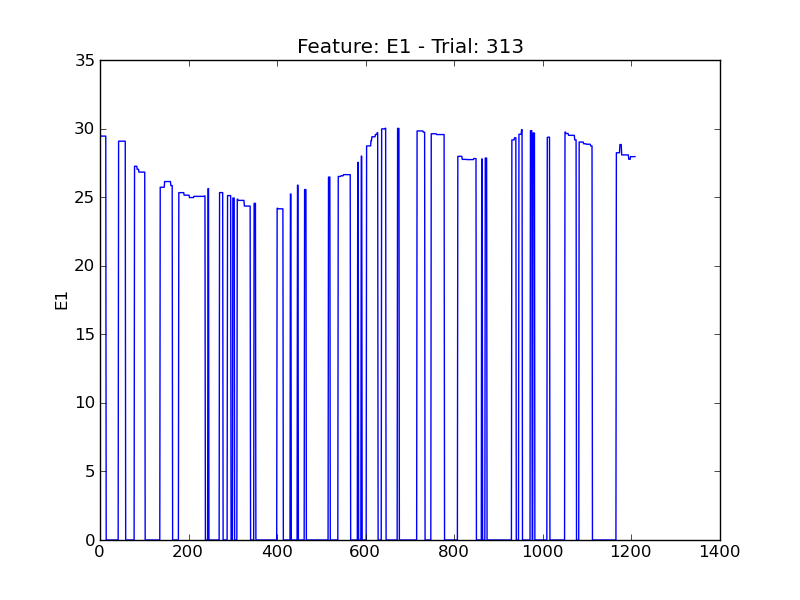
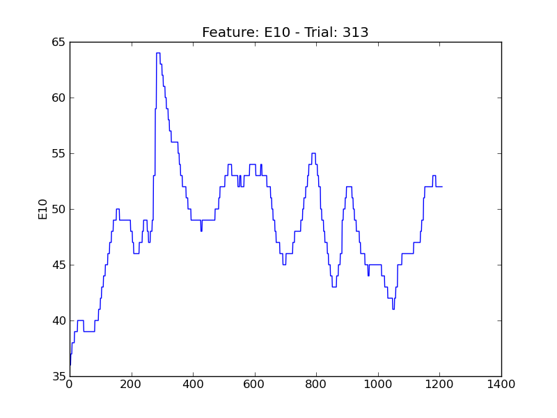
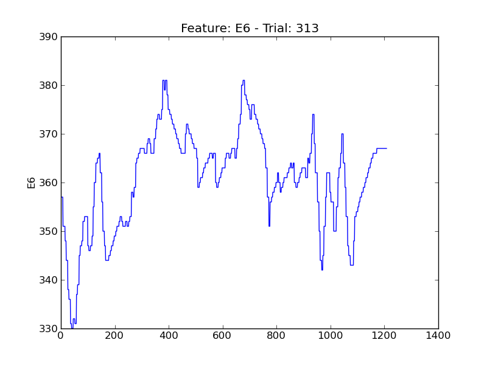
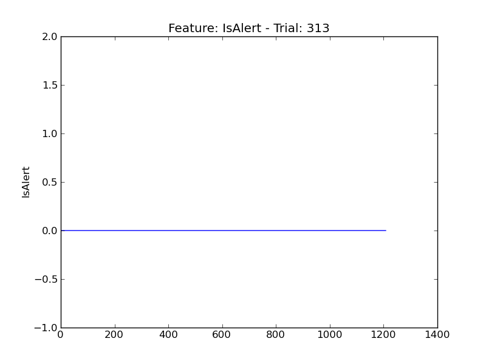
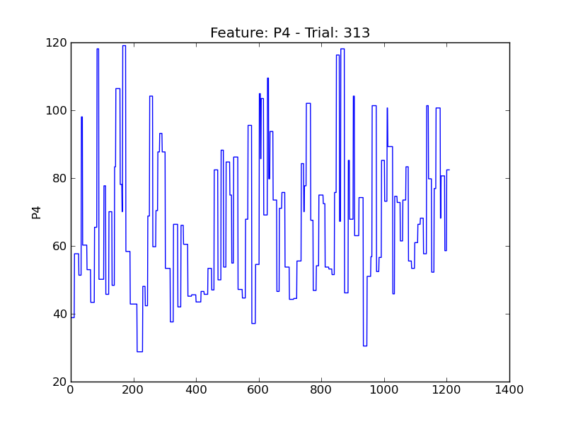
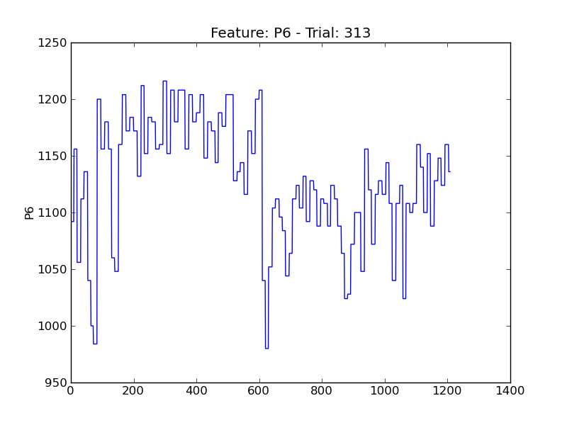
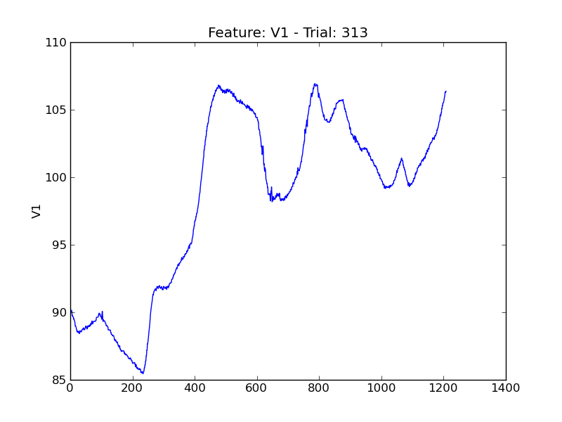
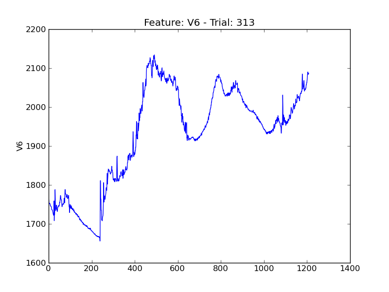
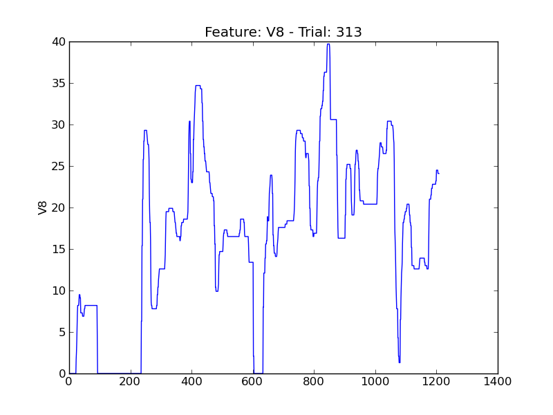

====
t313
====

.. image:: plots/t313-E2.png
    :width: 550px

.. image:: plots/t313-E4.png
    :width: 550px

.. image:: plots/t313-E5.png
    :width: 550px

.. image:: plots/t313-P1.png
    :width: 550px

.. image:: plots/t313-P5.png
    :width: 550px

.. image:: plots/t313-P7.png
    :width: 550px

.. image:: plots/t313-V11.png
    :width: 550px

.. image:: plots/t313-V2.png
    :width: 550px

.. image:: plots/t313-V3.png
    :width: 550px

