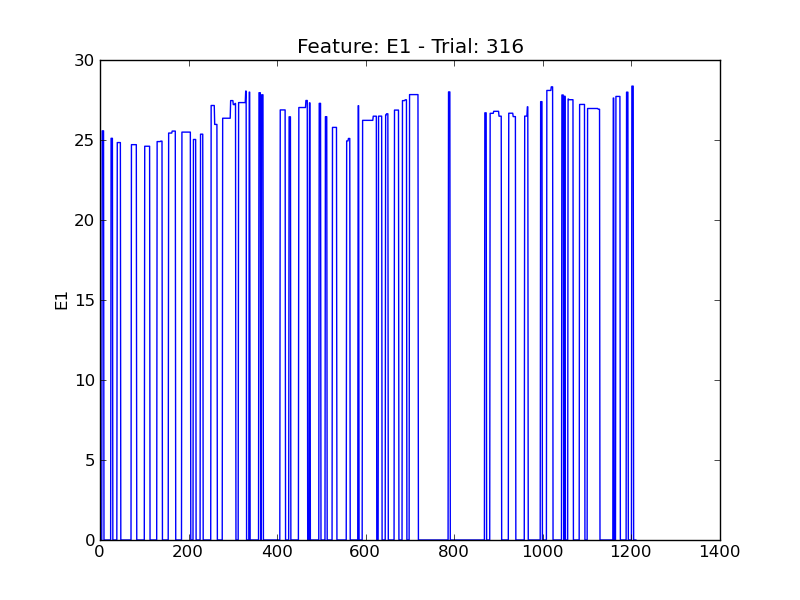
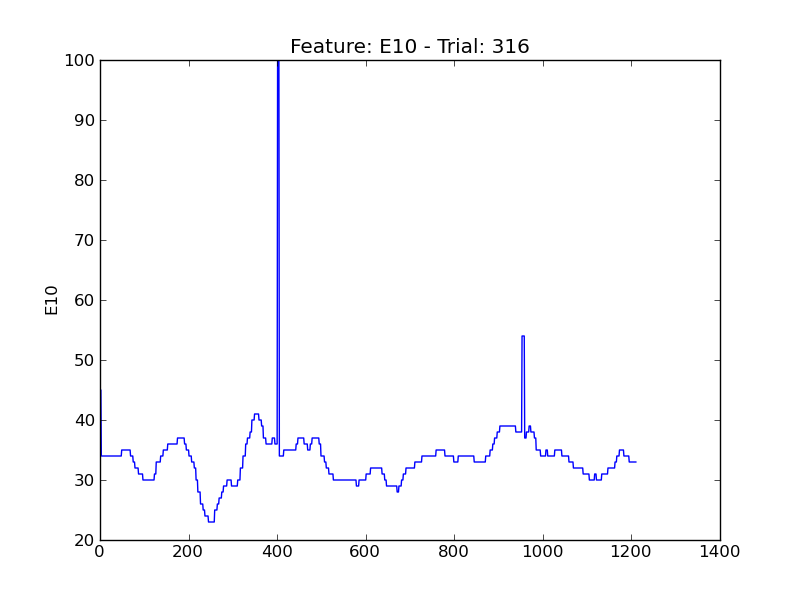
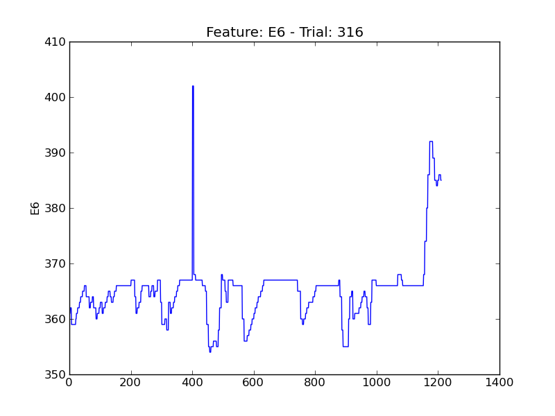
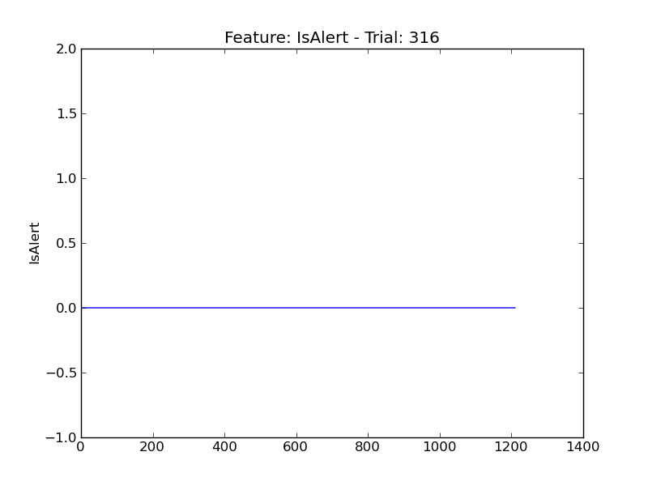
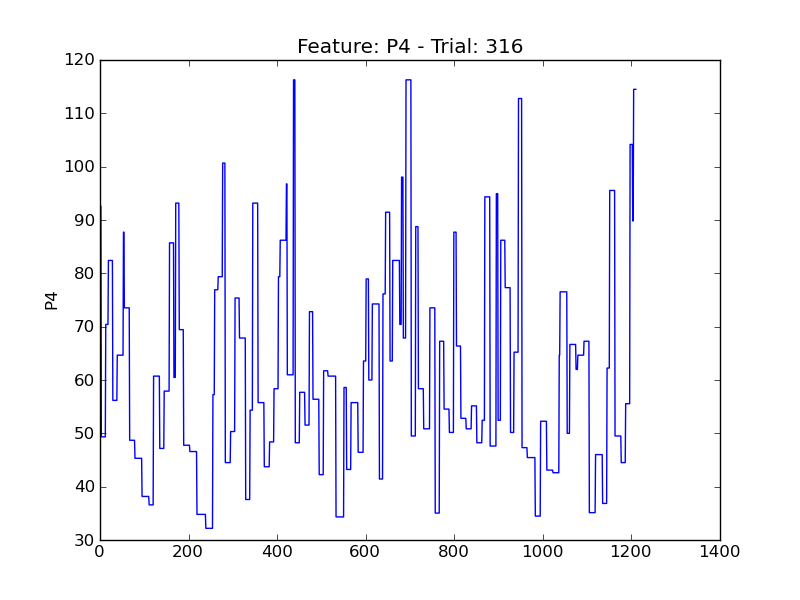
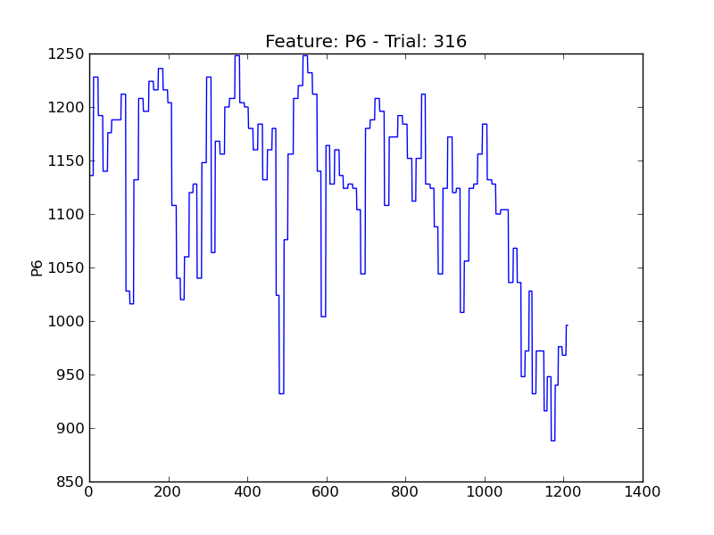
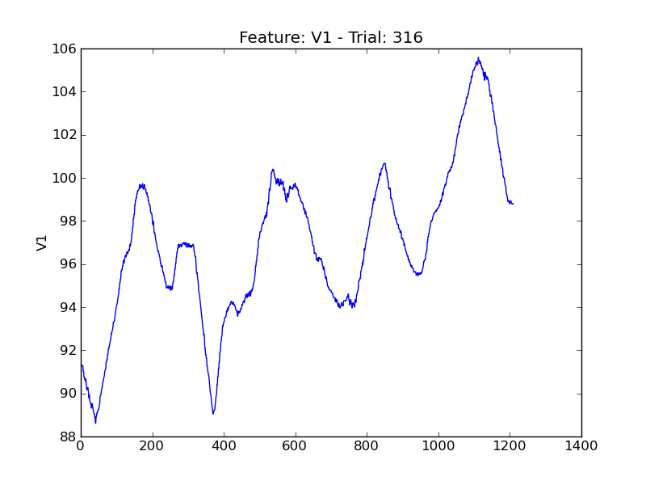
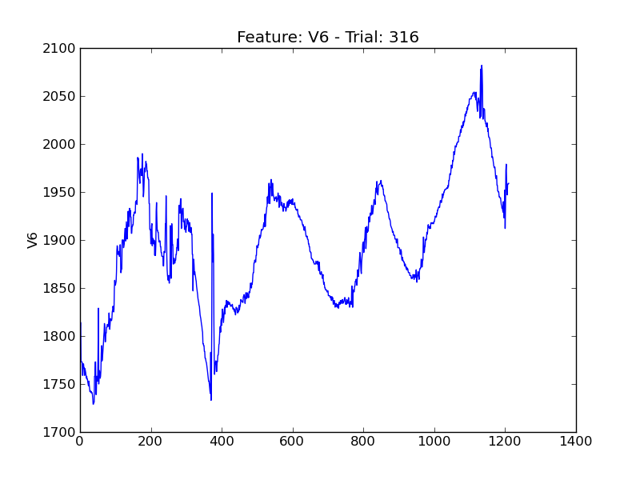
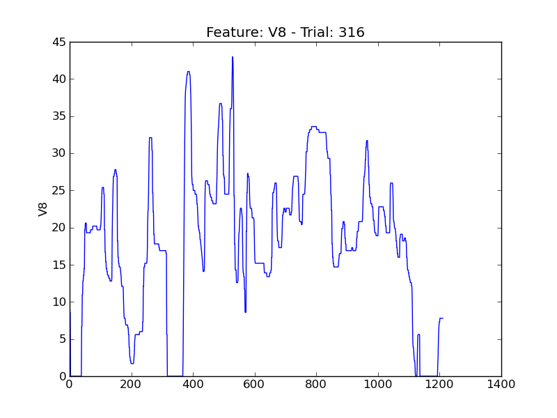

====
t316
====

.. image:: plots/t316-E2.png
    :width: 550px

.. image:: plots/t316-E4.png
    :width: 550px

.. image:: plots/t316-E5.png
    :width: 550px

.. image:: plots/t316-P1.png
    :width: 550px

.. image:: plots/t316-P5.png
    :width: 550px

.. image:: plots/t316-P7.png
    :width: 550px

.. image:: plots/t316-V11.png
    :width: 550px

.. image:: plots/t316-V2.png
    :width: 550px

.. image:: plots/t316-V3.png
    :width: 550px

