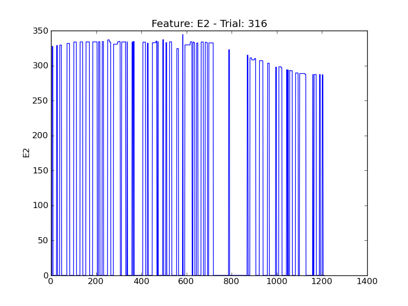
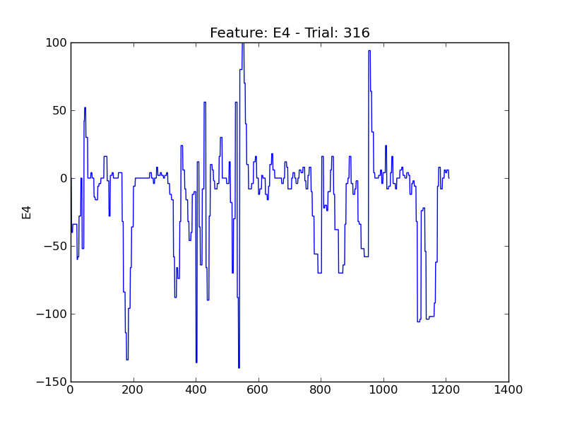
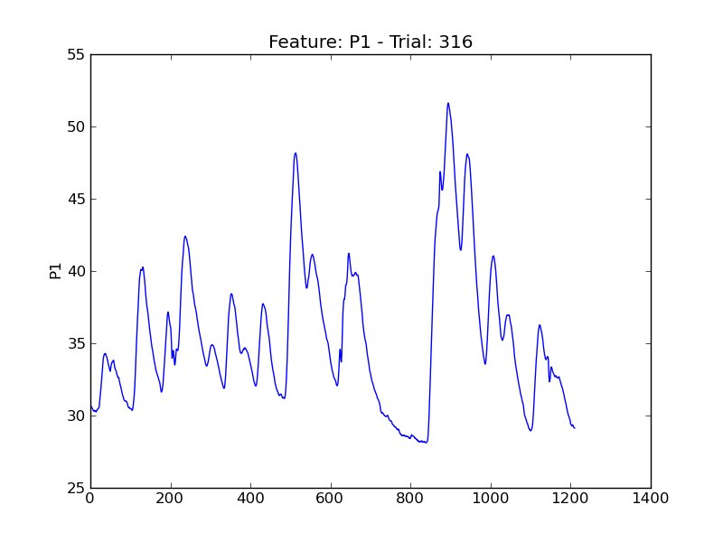
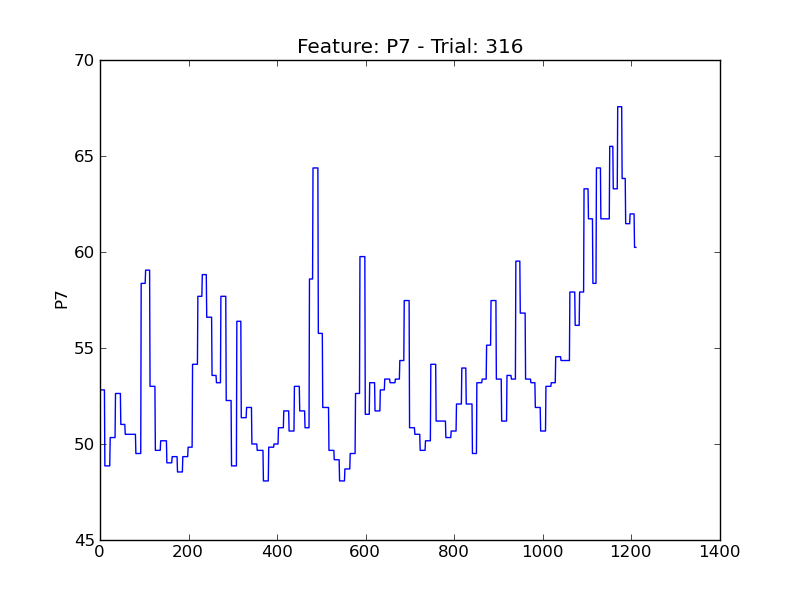
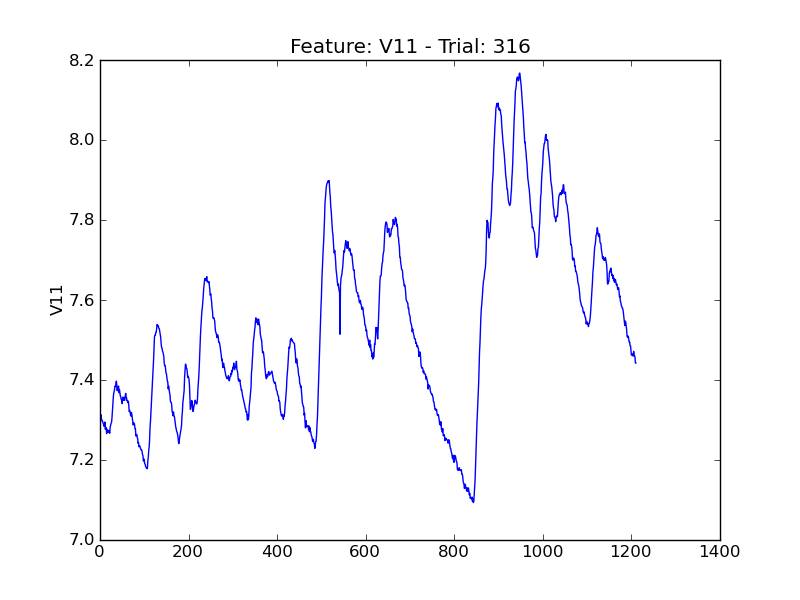
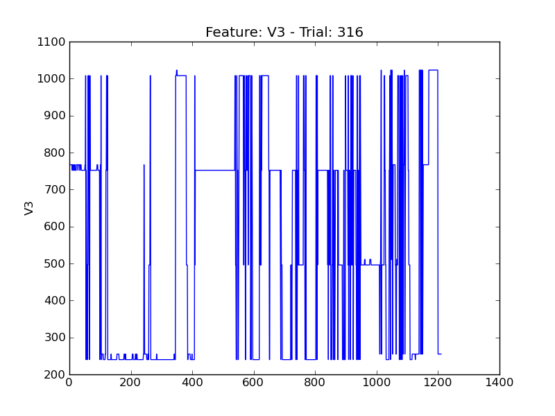

====
t316
====

.. image:: plots/t316-E1.png
    :width: 550px

.. image:: plots/t316-E5.png
    :width: 550px

.. image:: plots/t316-P5.png
    :width: 550px

.. image:: plots/t316-V2.png
    :width: 550px

