====
t333
====

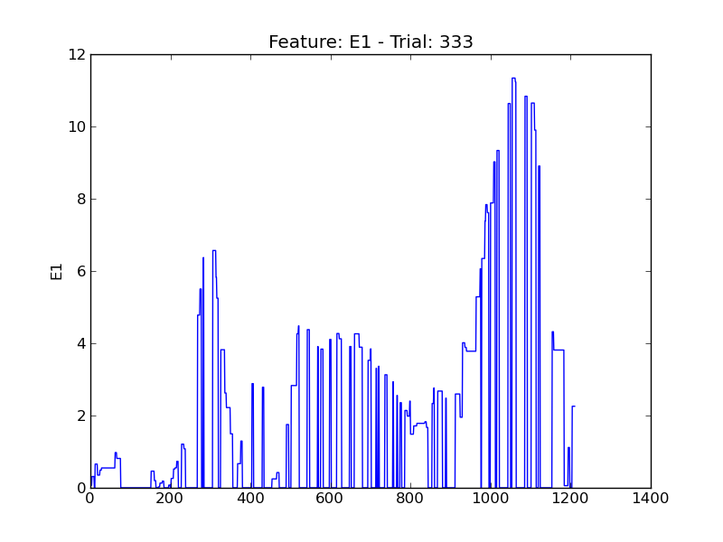

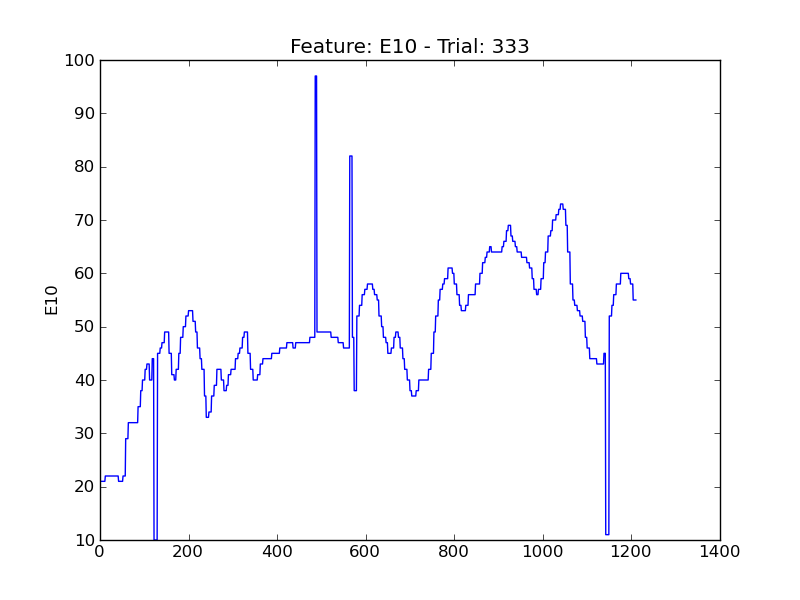

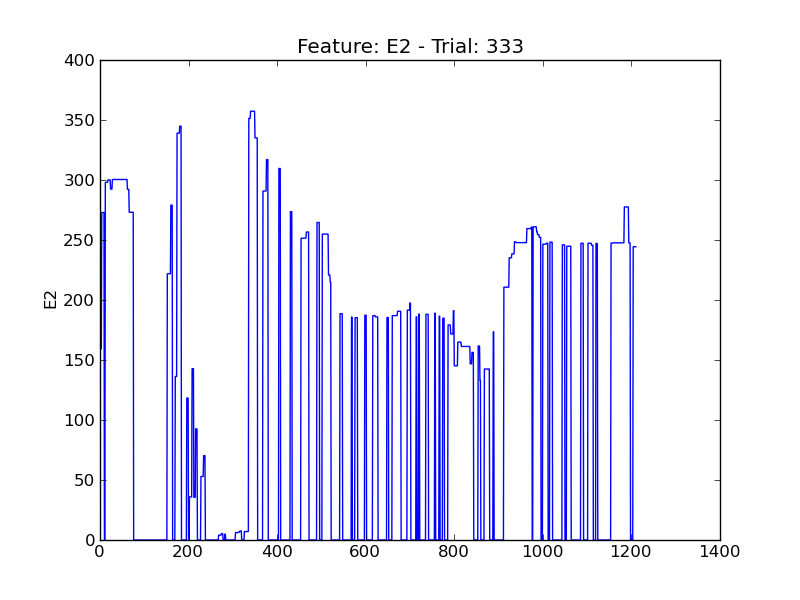

.. image:: plots/t333-E4.png
    :width: 550px

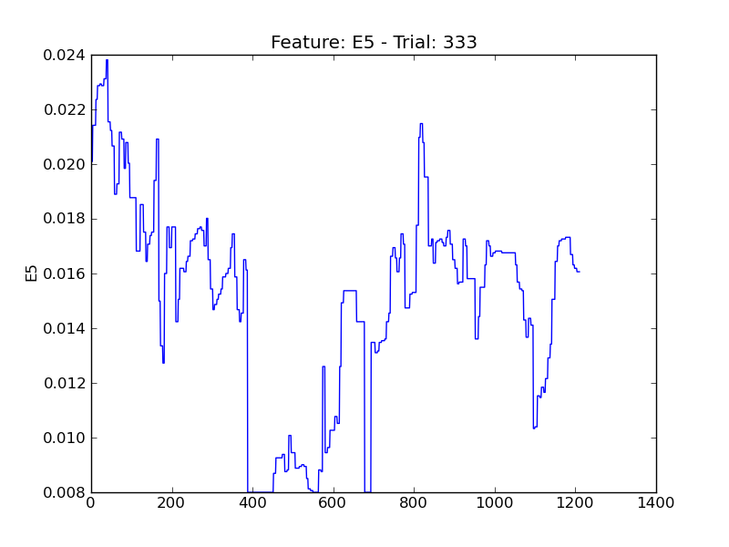

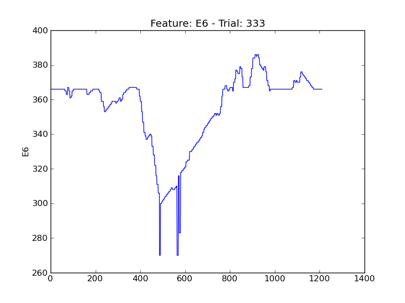

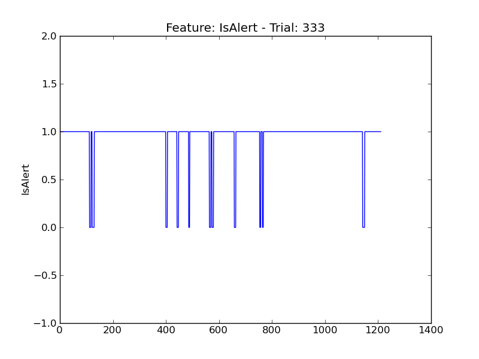

.. image:: plots/t333-P1.png
    :width: 550px

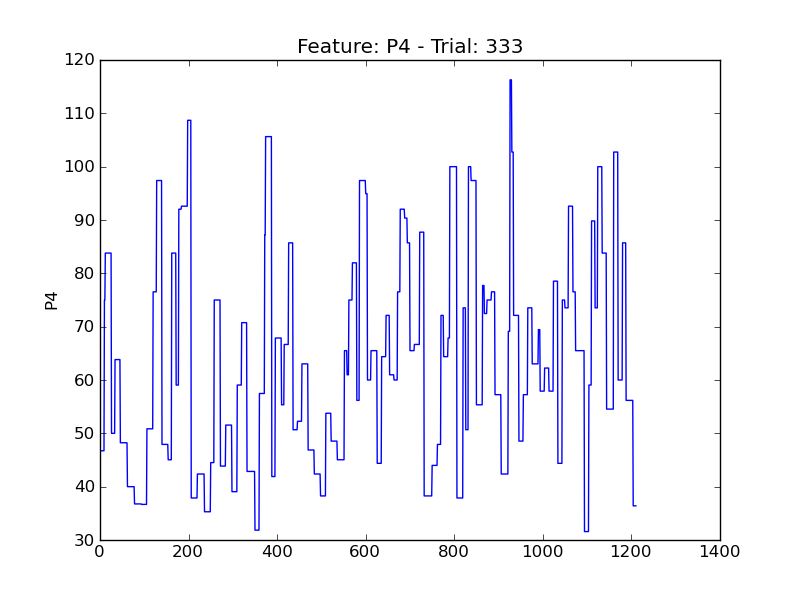

.. image:: plots/t333-P5.png
    :width: 550px

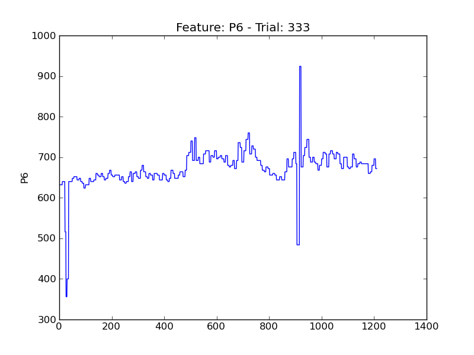

.. image:: plots/t333-P7.png
    :width: 550px

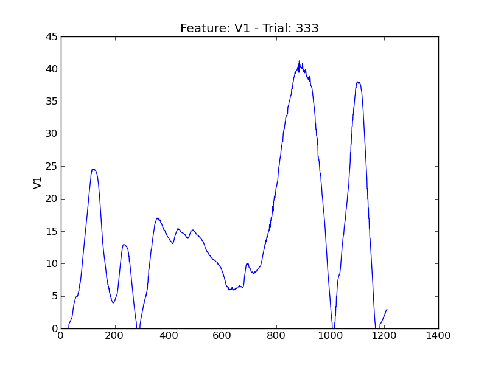

.. image:: plots/t333-V11.png
    :width: 550px

.. image:: plots/t333-V2.png
    :width: 550px

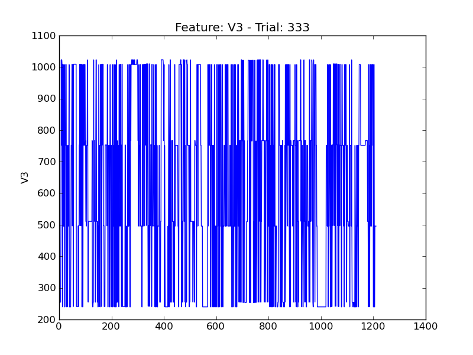

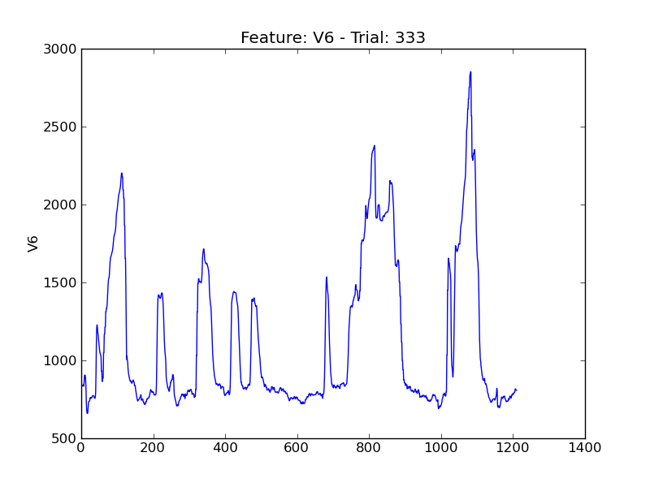

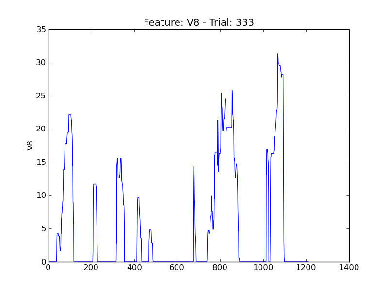
