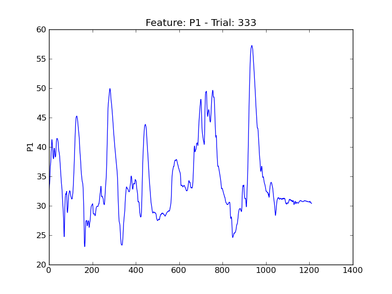
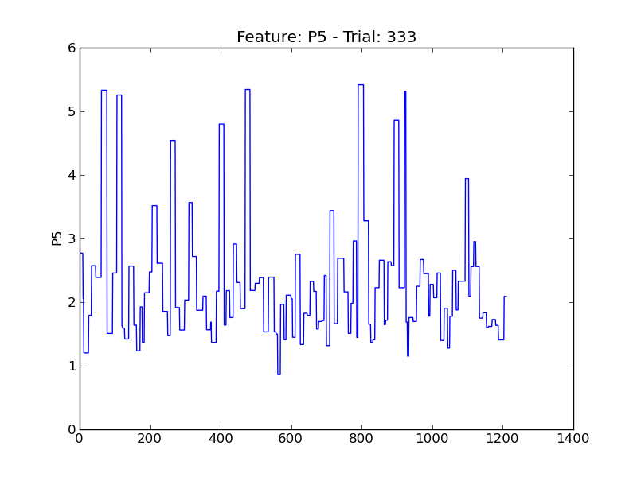
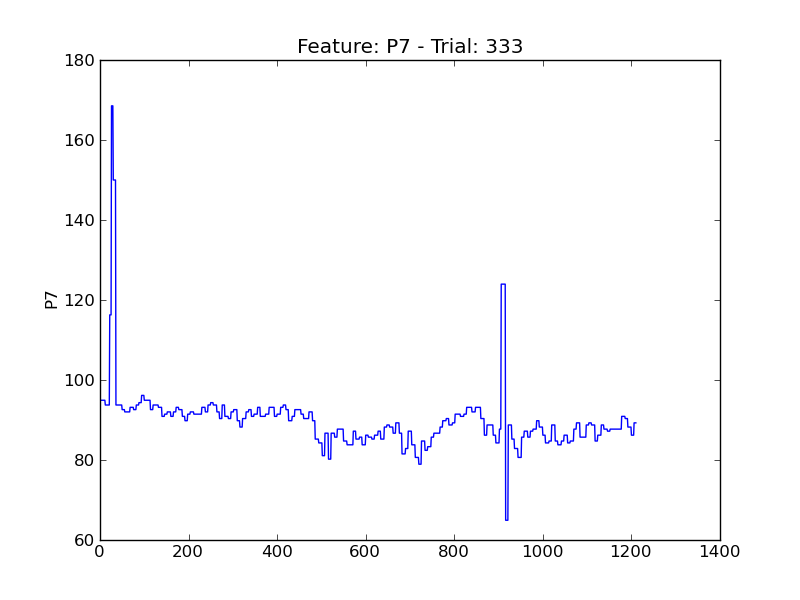

====
t333
====

.. image:: plots/t333-E1.png
    :width: 550px

.. image:: plots/t333-E4.png
    :width: 550px

.. image:: plots/t333-P6.png
    :width: 550px

.. image:: plots/t333-V1.png
    :width: 550px

.. image:: plots/t333-V11.png
    :width: 550px

.. image:: plots/t333-V2.png
    :width: 550px

.. image:: plots/t333-V3.png
    :width: 550px

.. image:: plots/t333-V8.png
    :width: 550px
