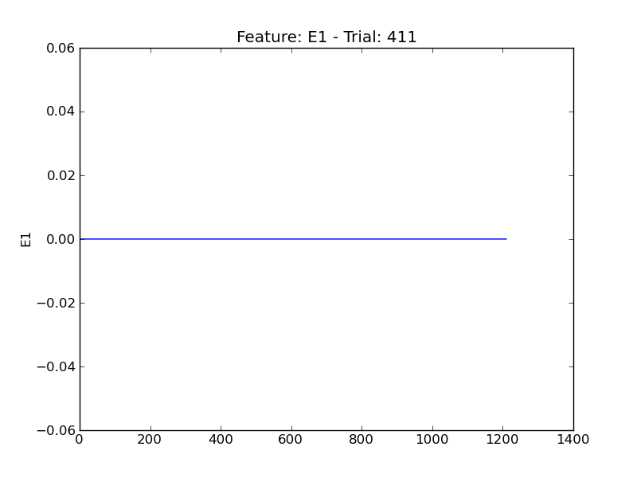
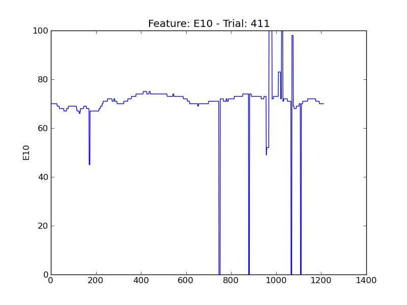
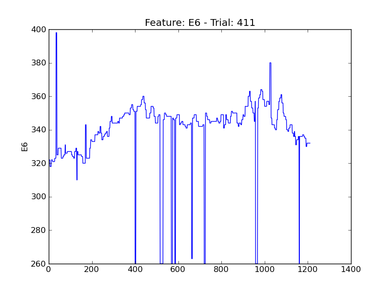
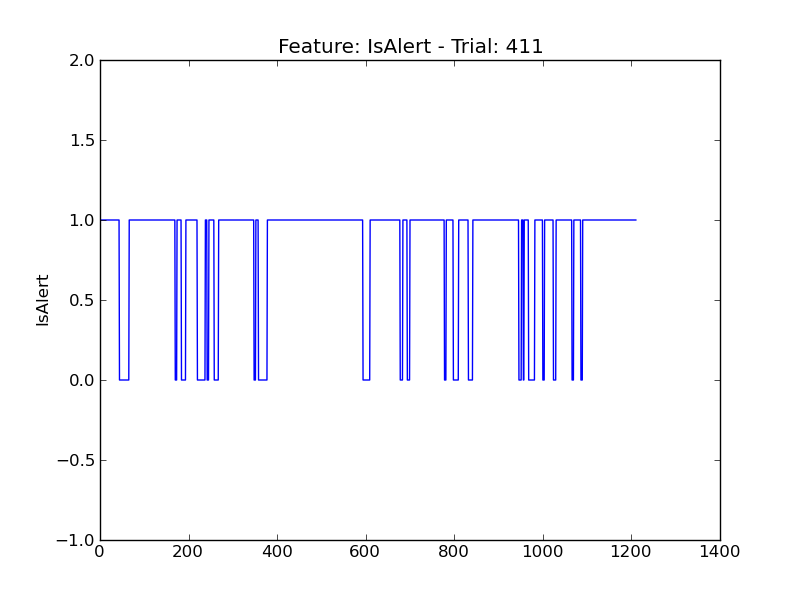
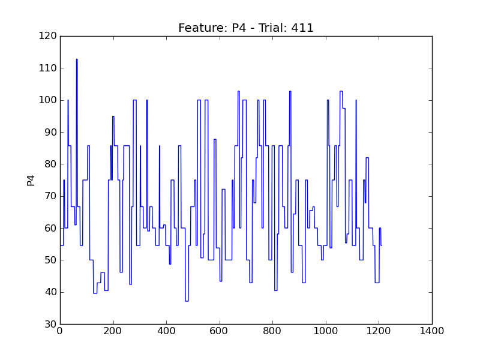
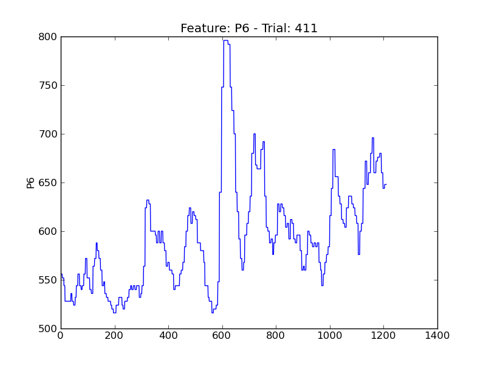
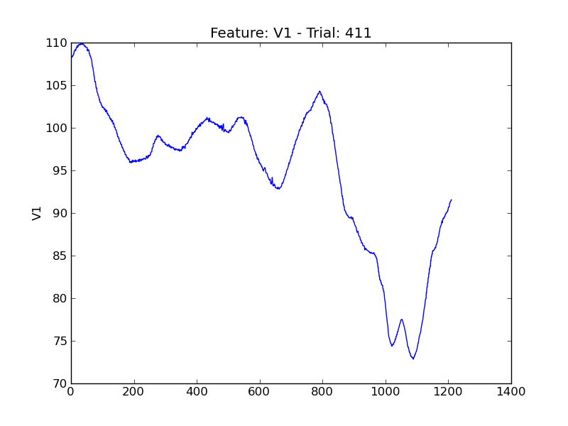
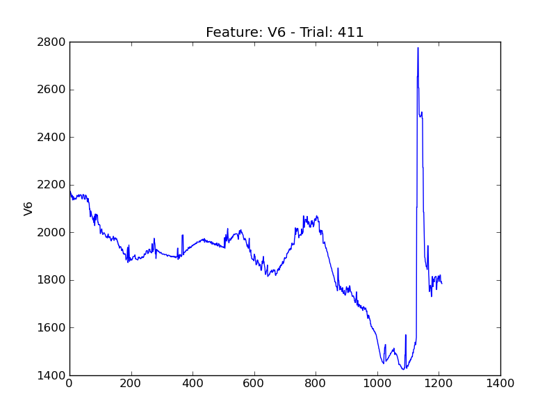
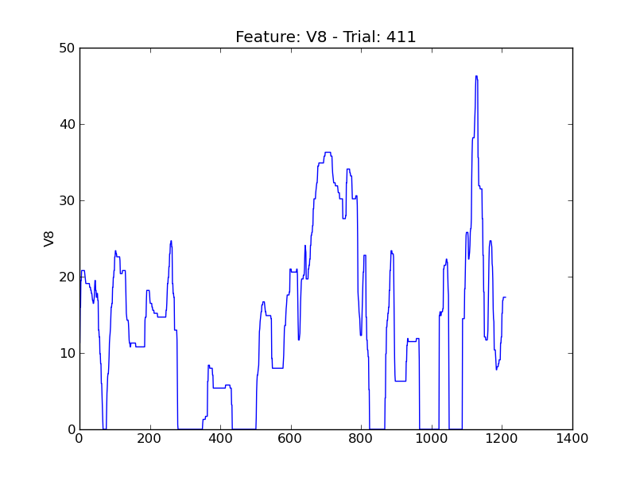

====
t411
====

.. image:: plots/t411-E2.png
    :width: 550px

.. image:: plots/t411-E4.png
    :width: 550px

.. image:: plots/t411-E5.png
    :width: 550px

.. image:: plots/t411-P1.png
    :width: 550px

.. image:: plots/t411-P5.png
    :width: 550px

.. image:: plots/t411-P7.png
    :width: 550px

.. image:: plots/t411-V11.png
    :width: 550px

.. image:: plots/t411-V2.png
    :width: 550px

.. image:: plots/t411-V3.png
    :width: 550px

