====
t442
====

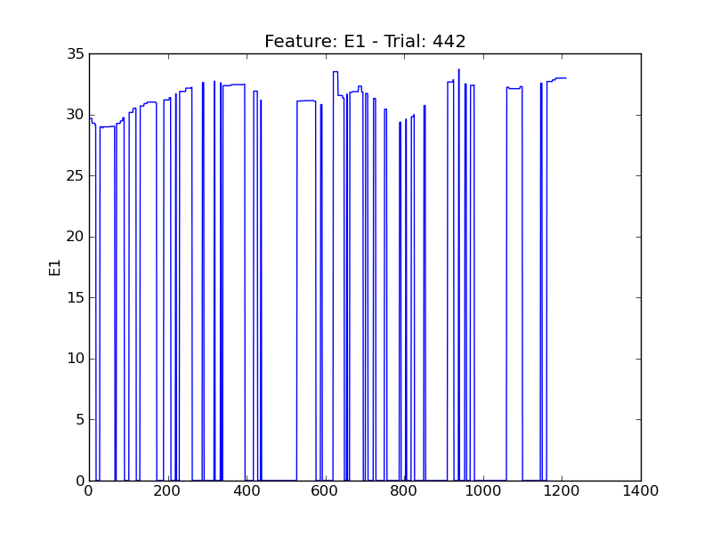

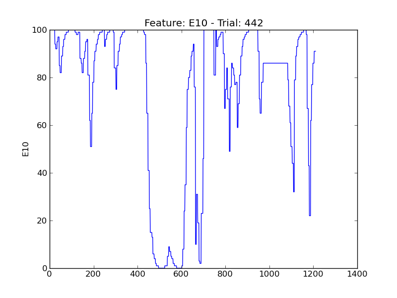

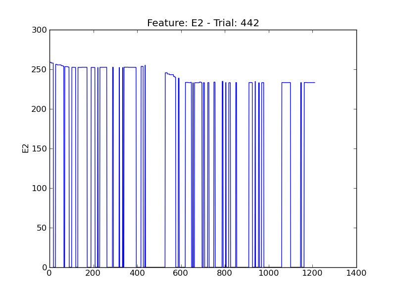

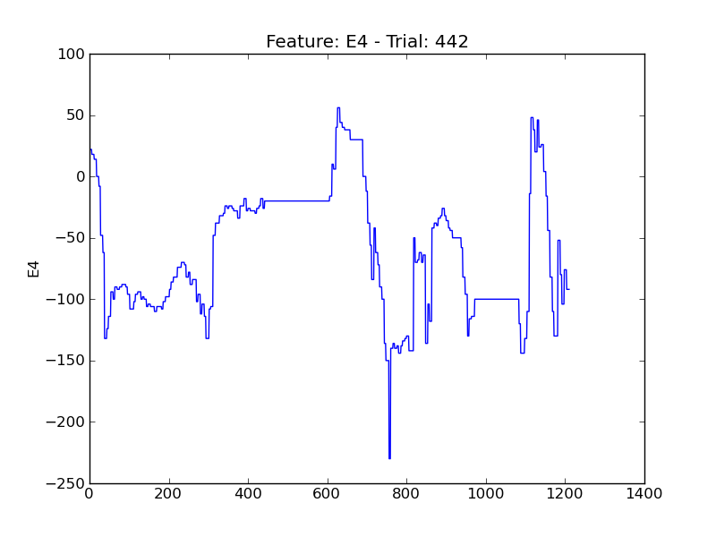

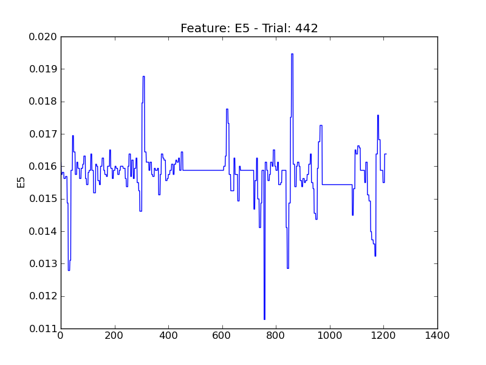

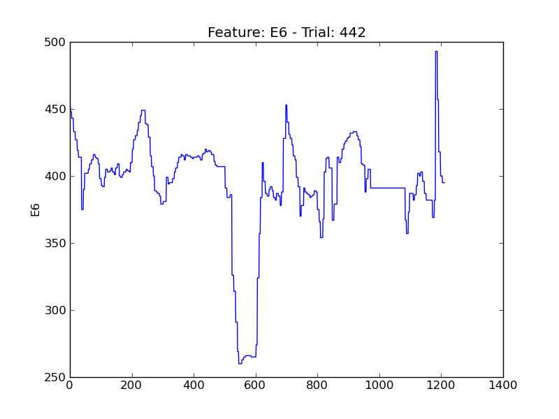

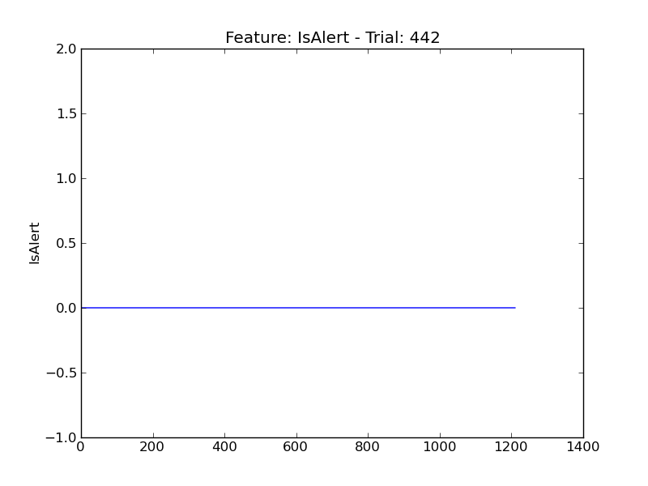

.. image:: plots/t442-P1.png
    :width: 550px

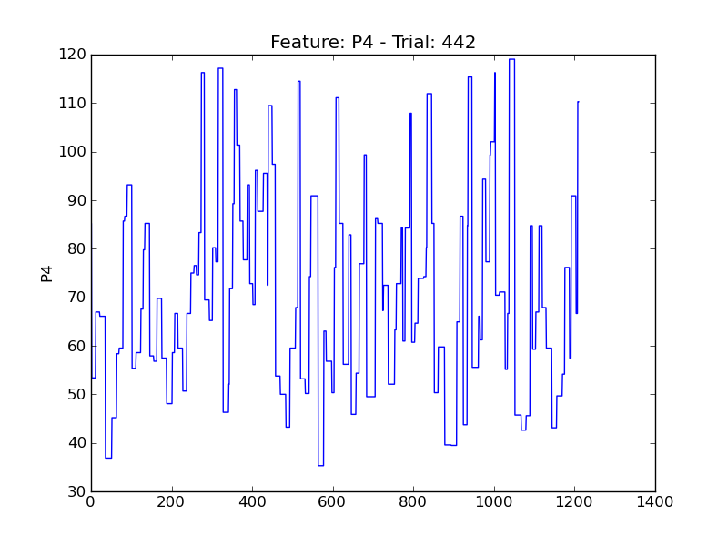

.. image:: plots/t442-P5.png
    :width: 550px

.. image:: plots/t442-P6.png
    :width: 550px

.. image:: plots/t442-P7.png
    :width: 550px

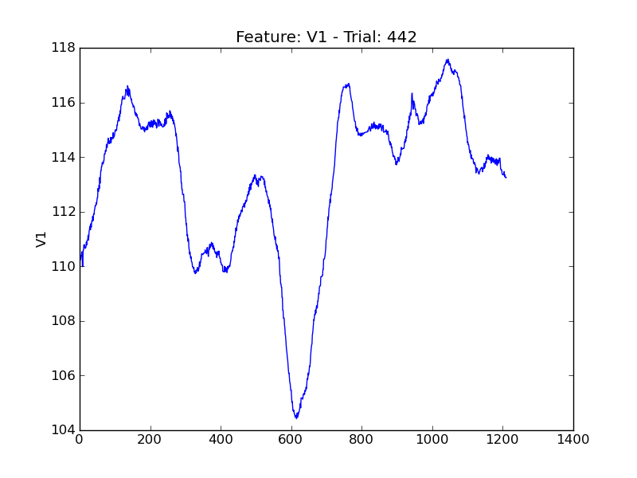

.. image:: plots/t442-V11.png
    :width: 550px

.. image:: plots/t442-V2.png
    :width: 550px

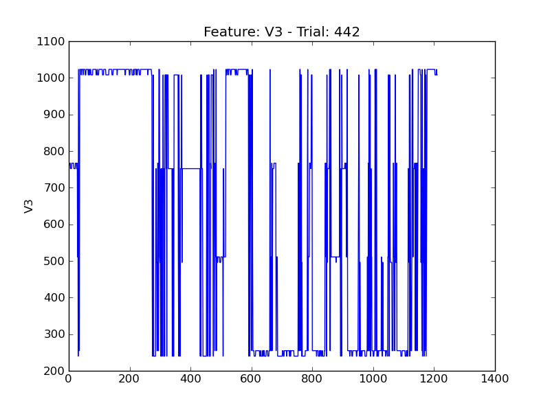

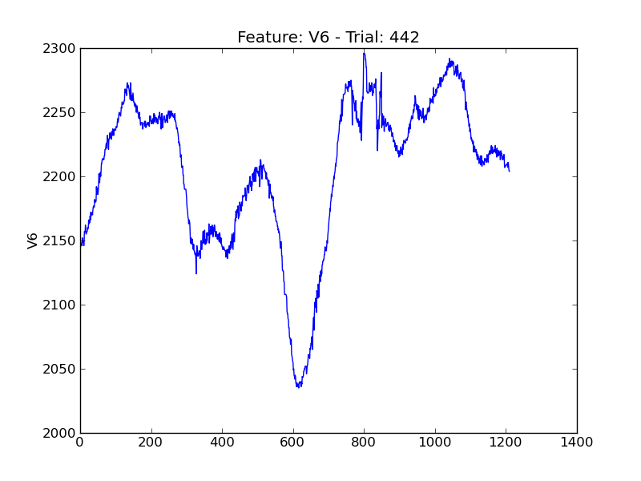

.. image:: plots/t442-V8.png
    :width: 550px
