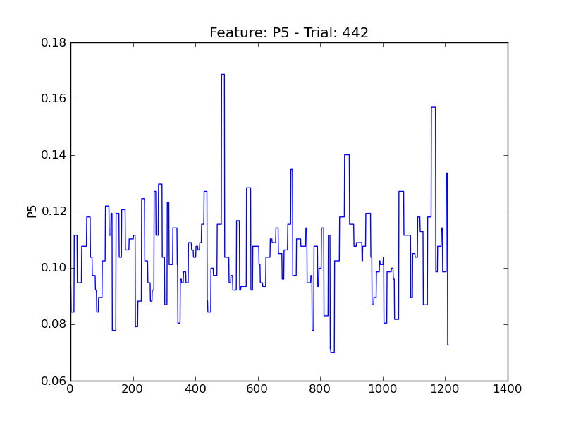
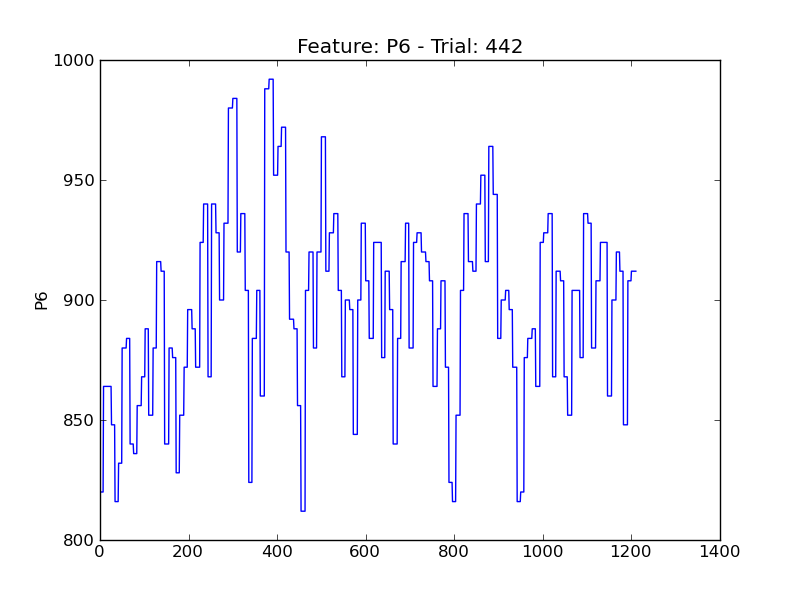
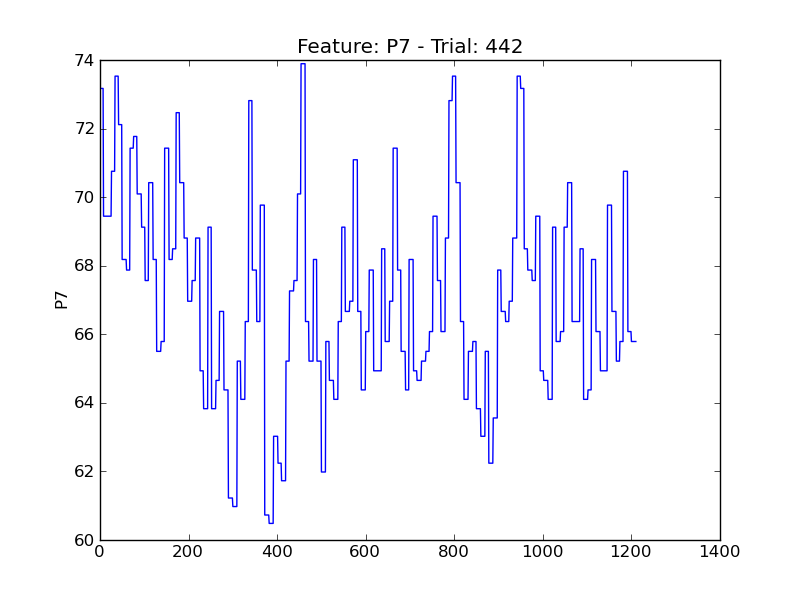
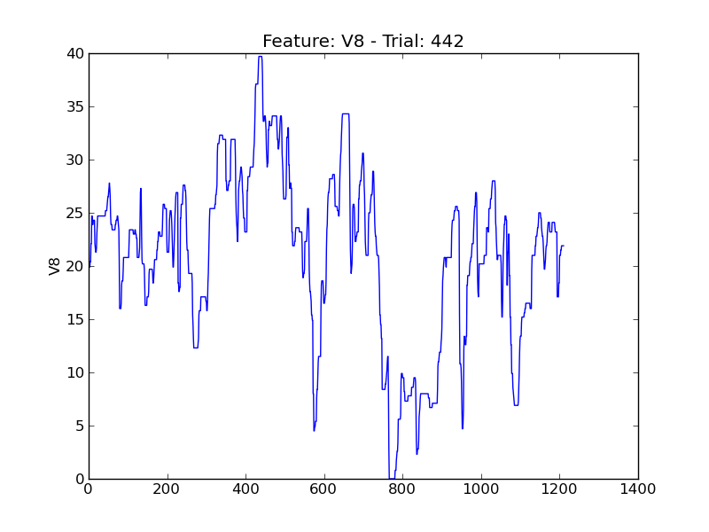

====
t442
====

.. image:: plots/t442-E2.png
    :width: 550px

.. image:: plots/t442-E5.png
    :width: 550px

.. image:: plots/t442-IsAlert.png
    :width: 550px

.. image:: plots/t442-P1.png
    :width: 550px

.. image:: plots/t442-V11.png
    :width: 550px

.. image:: plots/t442-V2.png
    :width: 550px

