===
t47
===

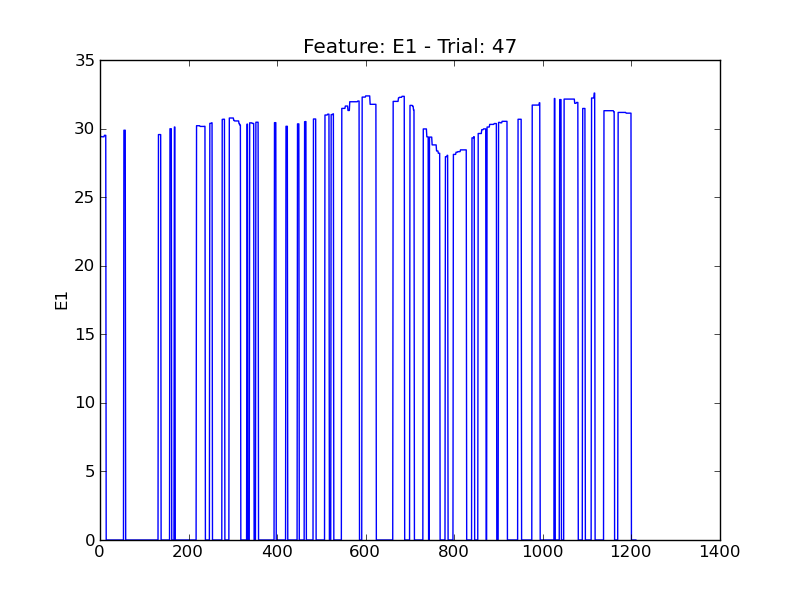

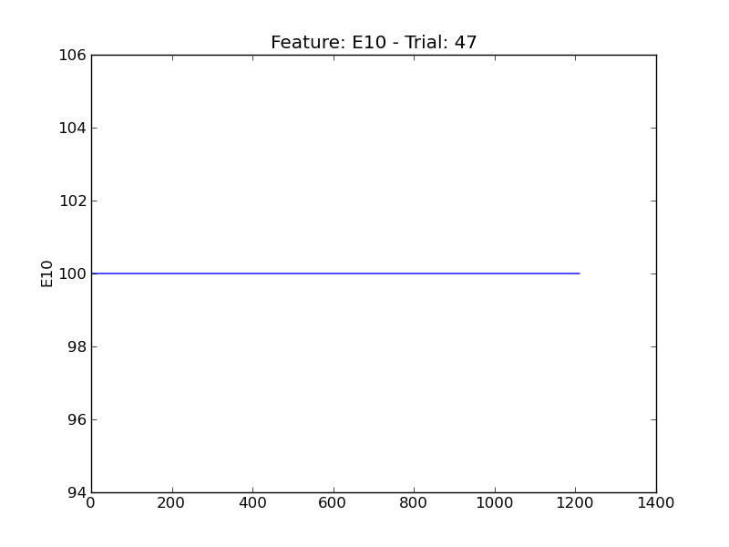

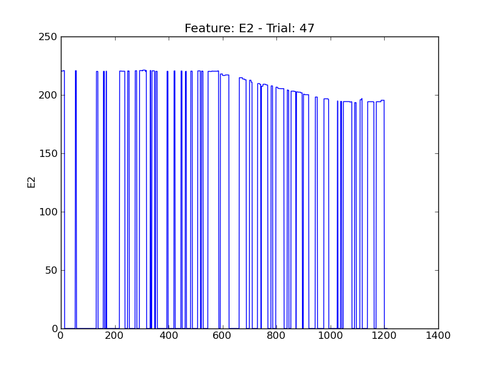

.. image:: plots/t47-E4.png
    :width: 550px

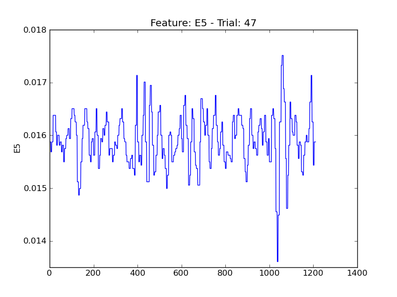

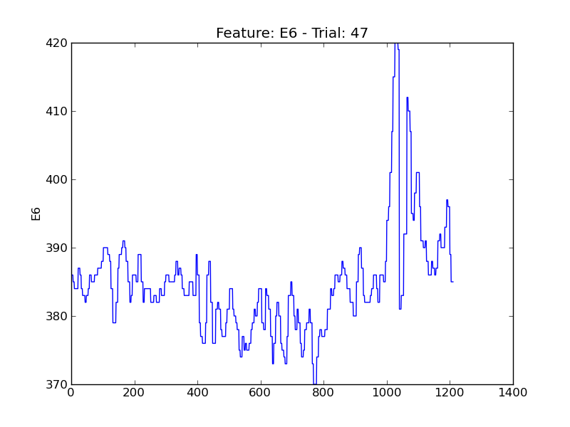

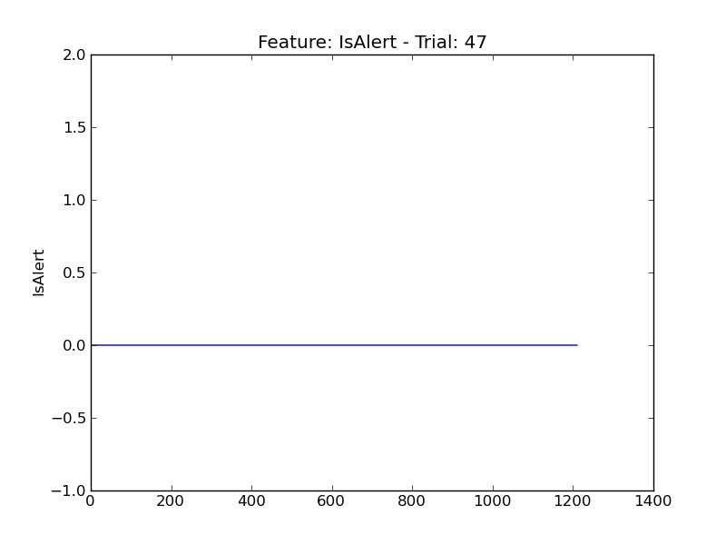

.. image:: plots/t47-P1.png
    :width: 550px

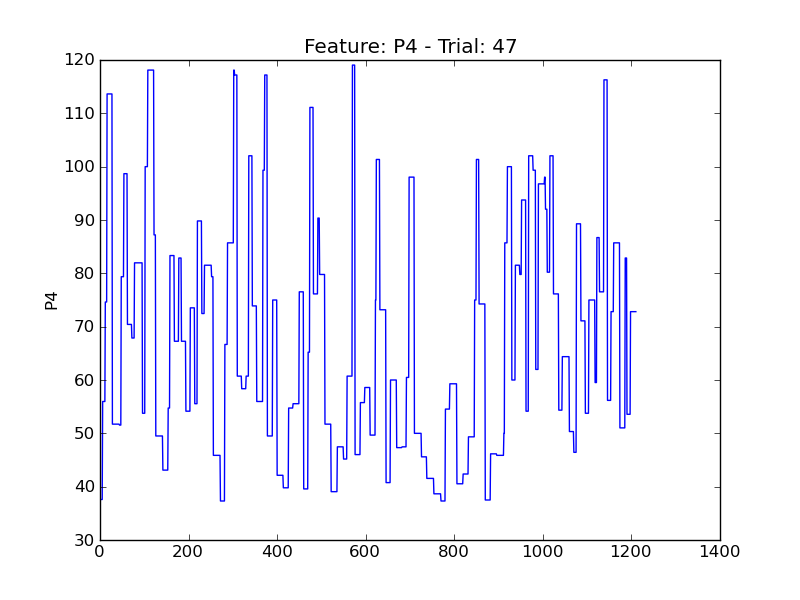

.. image:: plots/t47-P5.png
    :width: 550px

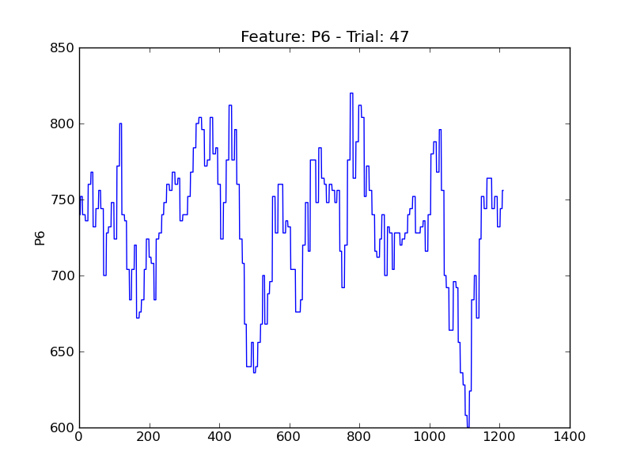

.. image:: plots/t47-P7.png
    :width: 550px

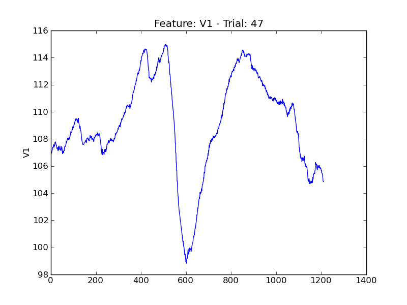

.. image:: plots/t47-V11.png
    :width: 550px

.. image:: plots/t47-V2.png
    :width: 550px

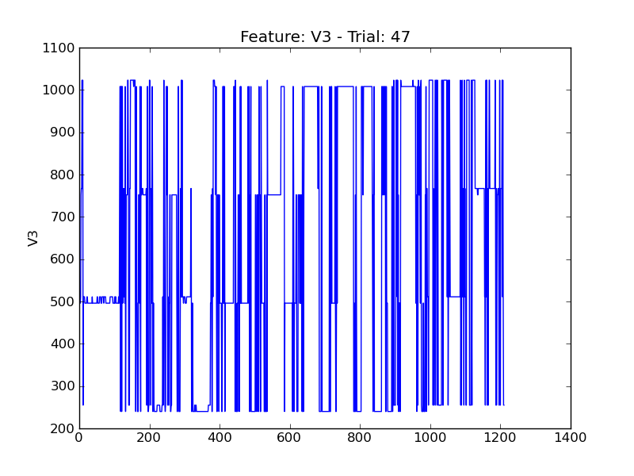

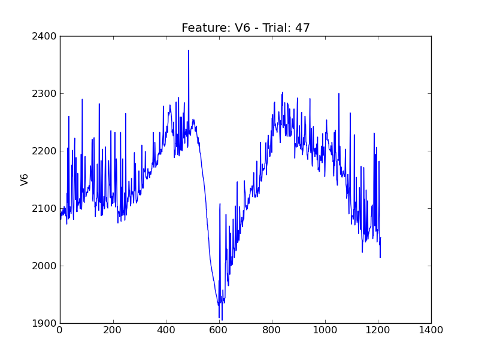

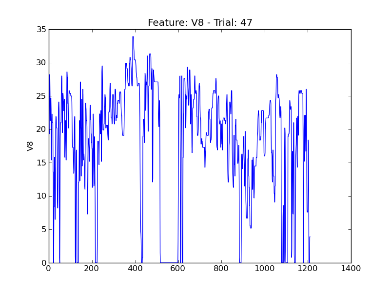
