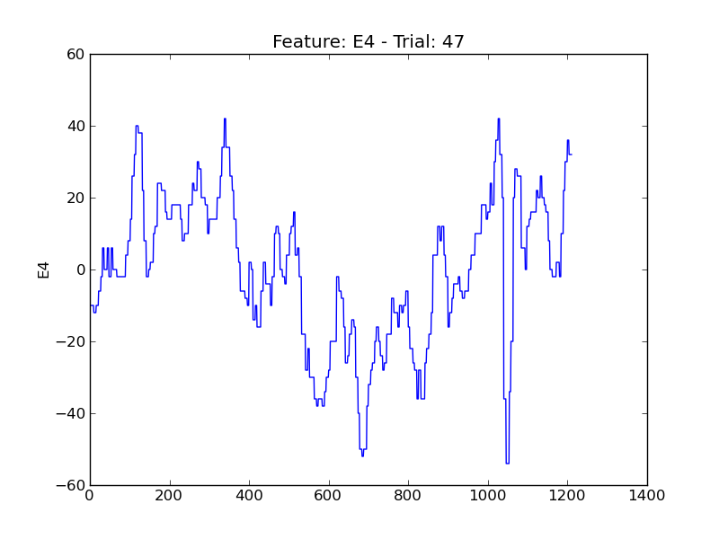
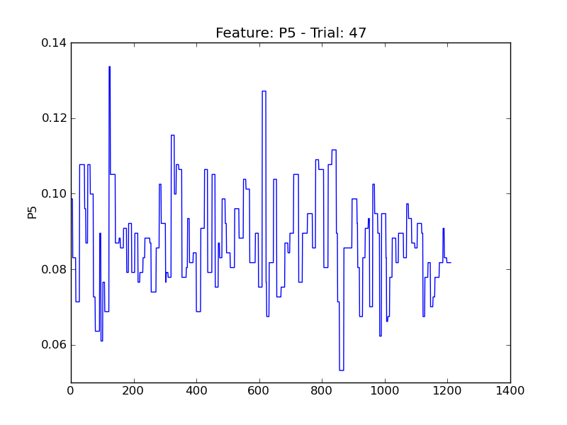
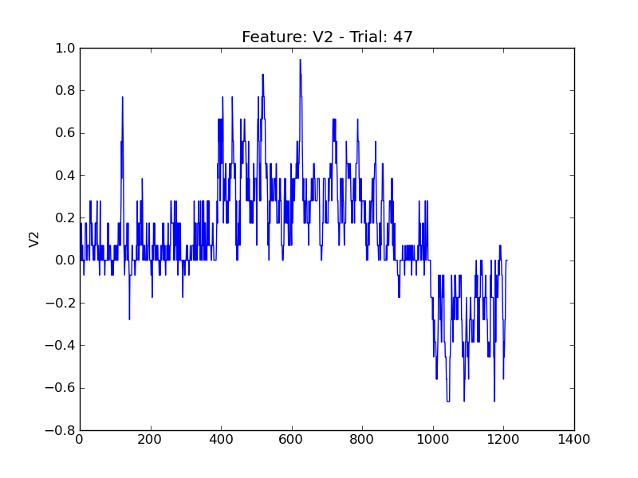

===
t47
===

.. image:: plots/t47-E2.png
    :width: 550px

.. image:: plots/t47-IsAlert.png
    :width: 550px

.. image:: plots/t47-P1.png
    :width: 550px

.. image:: plots/t47-P6.png
    :width: 550px

.. image:: plots/t47-P7.png
    :width: 550px

.. image:: plots/t47-V1.png
    :width: 550px

.. image:: plots/t47-V11.png
    :width: 550px

.. image:: plots/t47-V3.png
    :width: 550px

