====
t490
====

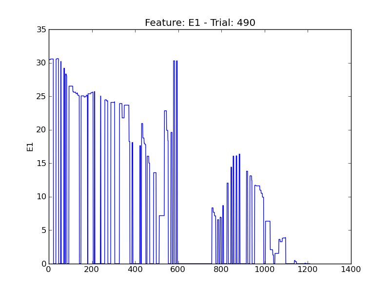

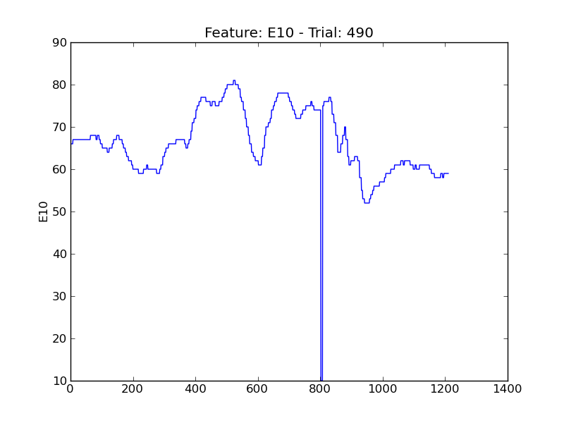

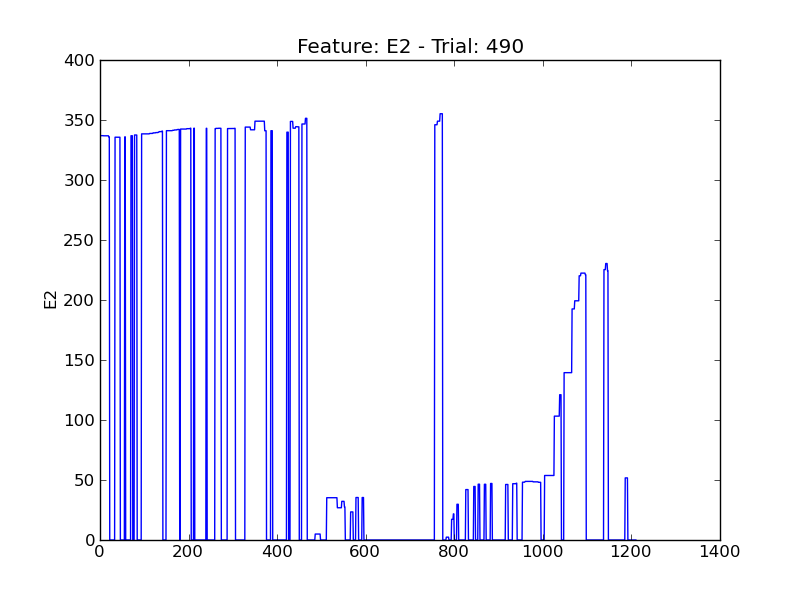

.. image:: plots/t490-E4.png
    :width: 550px

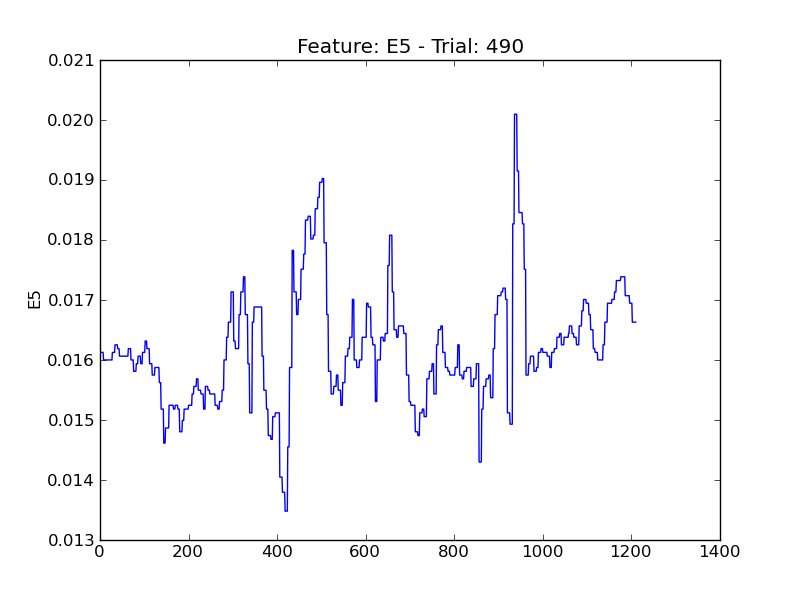

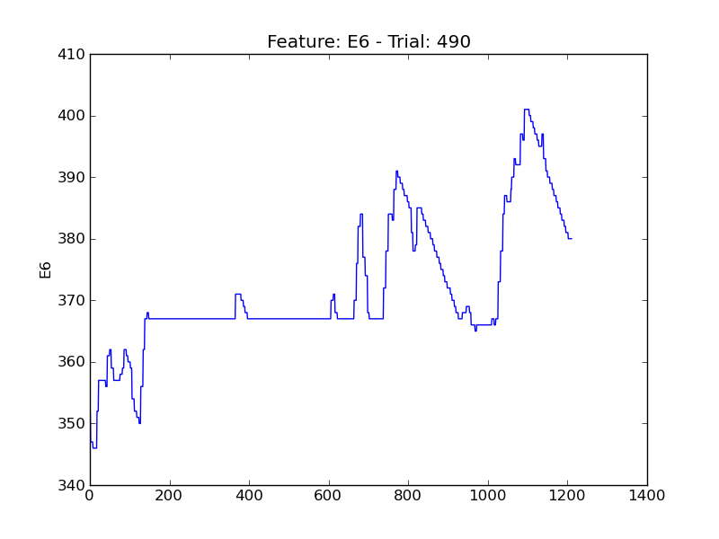

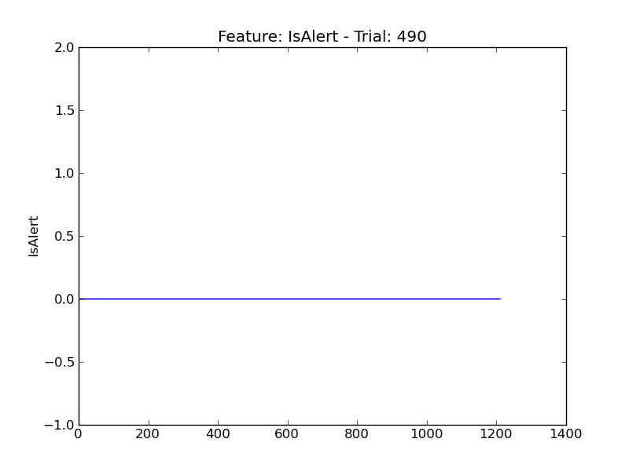

.. image:: plots/t490-P1.png
    :width: 550px

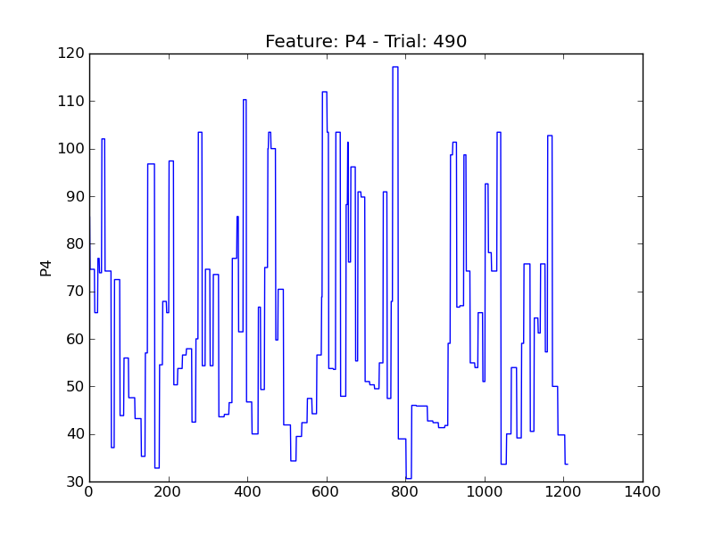

.. image:: plots/t490-P5.png
    :width: 550px

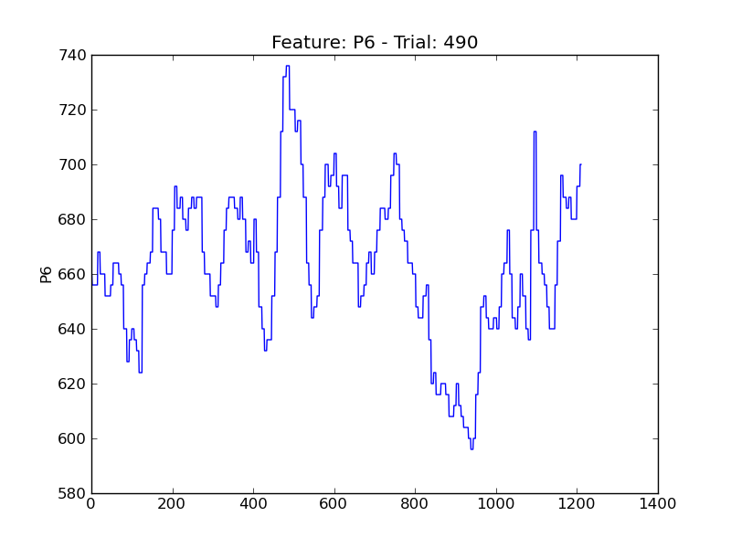

.. image:: plots/t490-P7.png
    :width: 550px

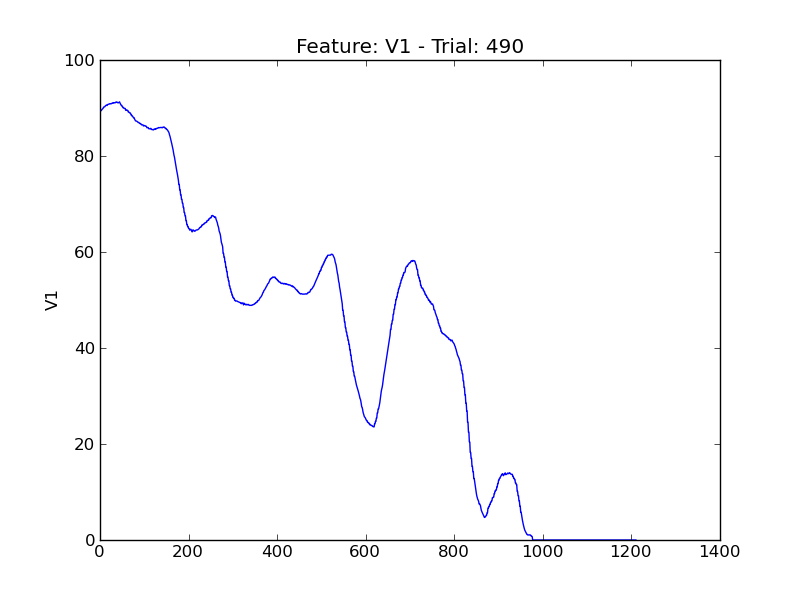

.. image:: plots/t490-V11.png
    :width: 550px

.. image:: plots/t490-V2.png
    :width: 550px

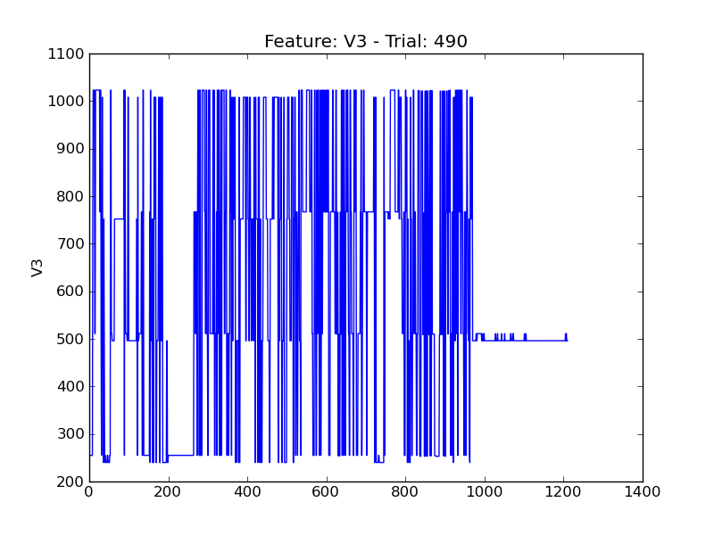

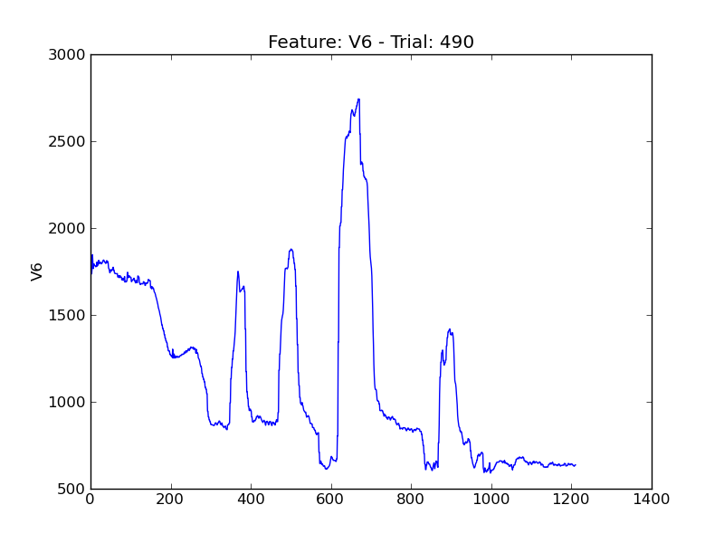

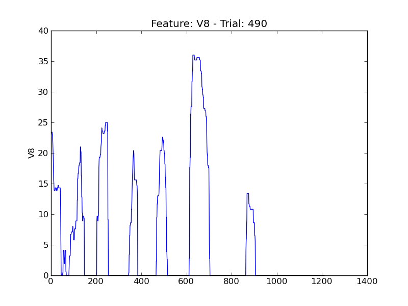
