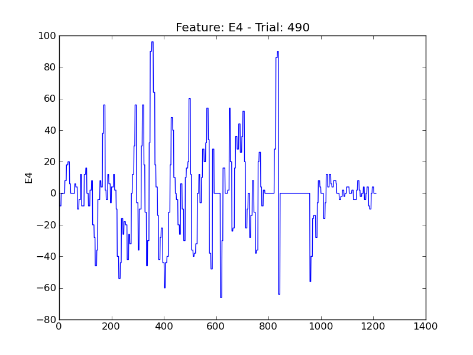
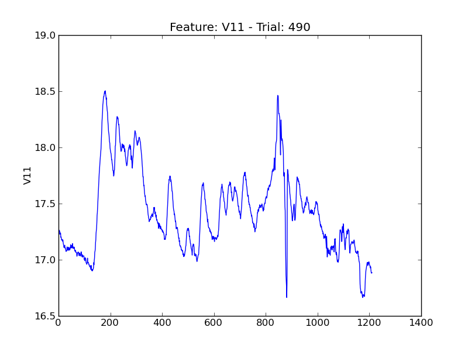
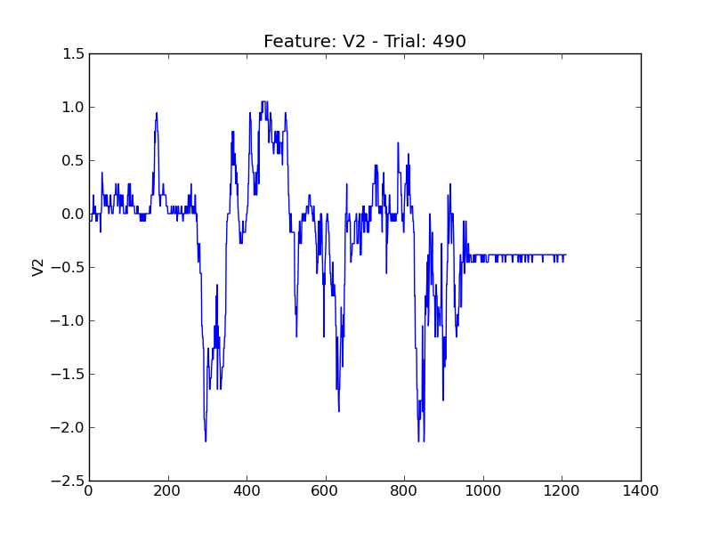

====
t490
====

.. image:: plots/t490-P1.png
    :width: 550px

.. image:: plots/t490-P5.png
    :width: 550px

.. image:: plots/t490-P6.png
    :width: 550px

.. image:: plots/t490-P7.png
    :width: 550px

.. image:: plots/t490-V3.png
    :width: 550px

